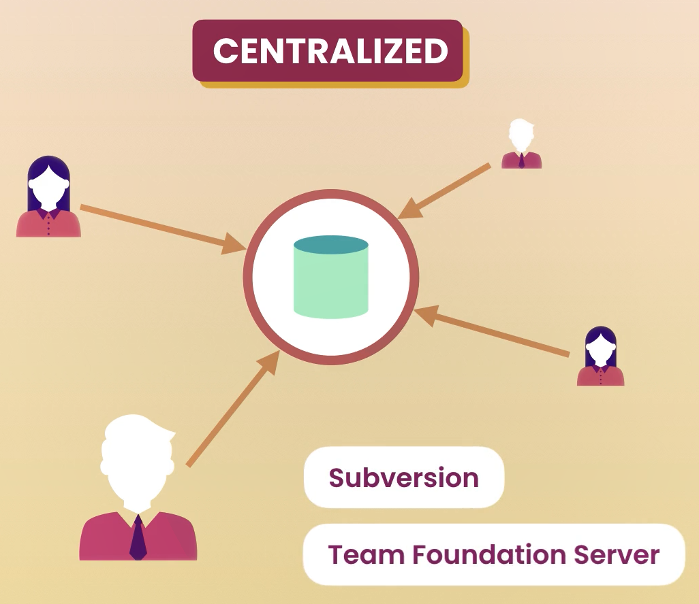
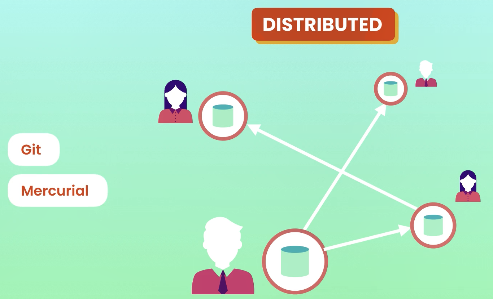
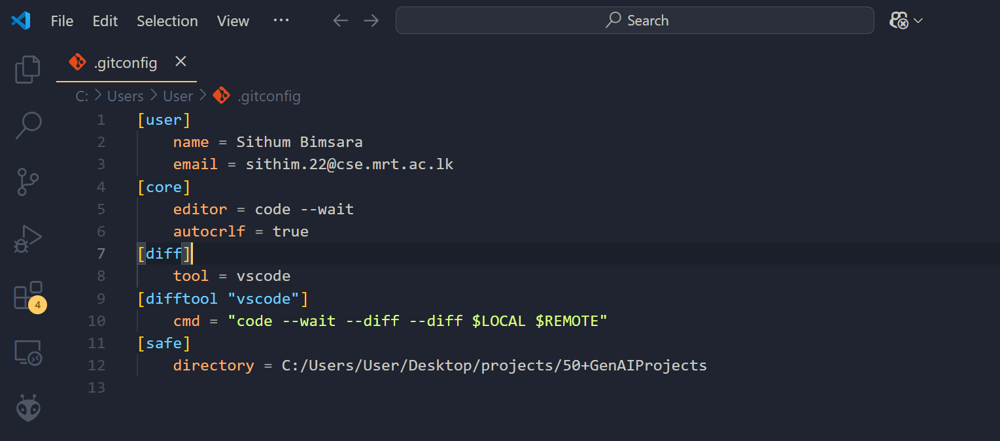
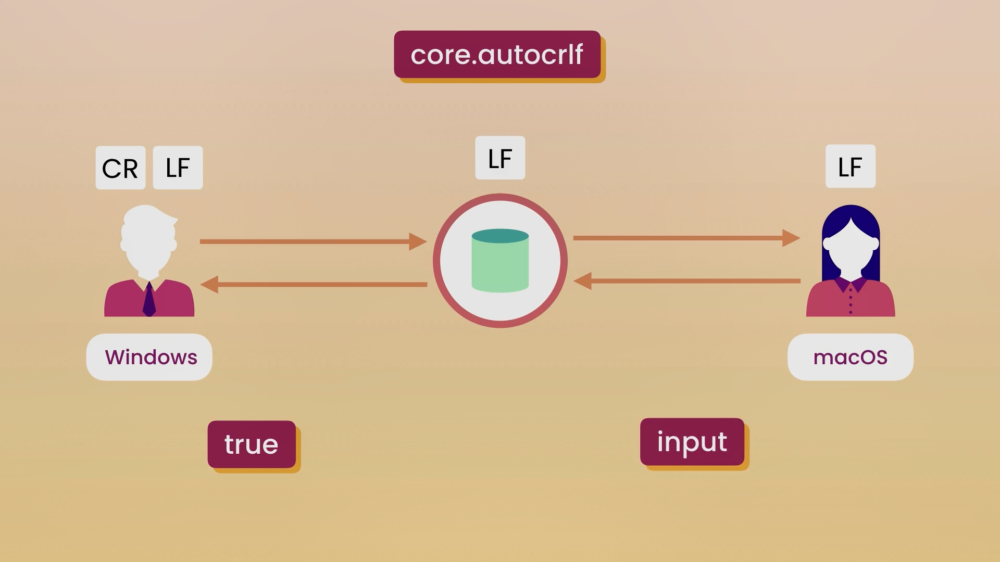
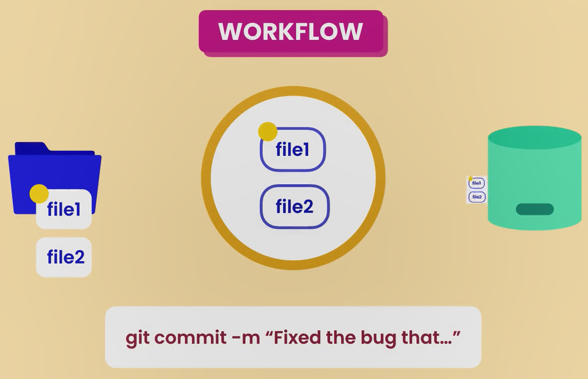
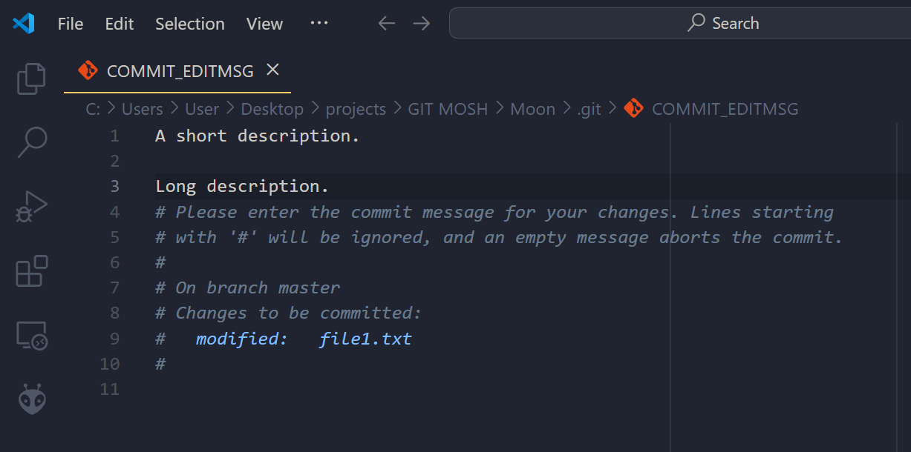
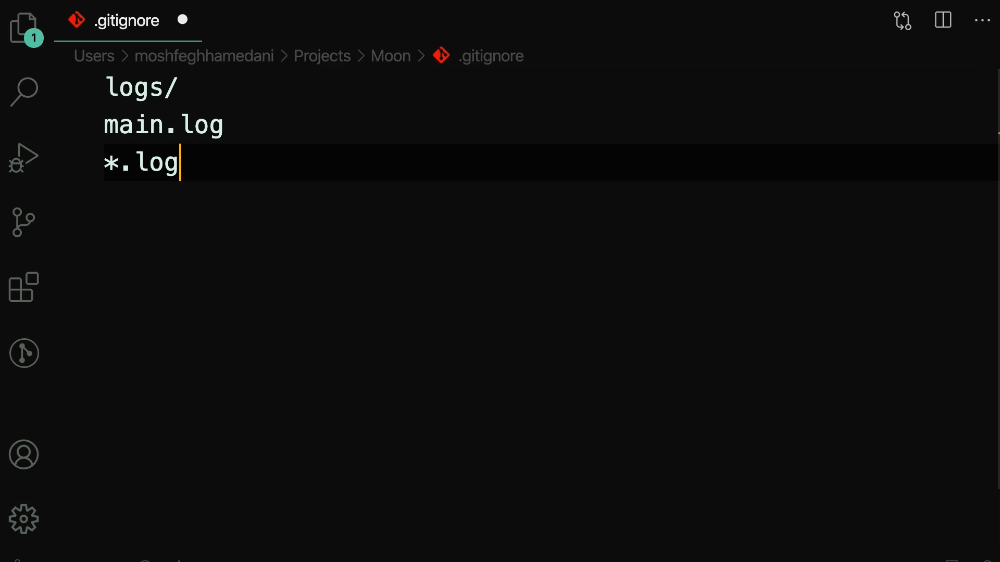
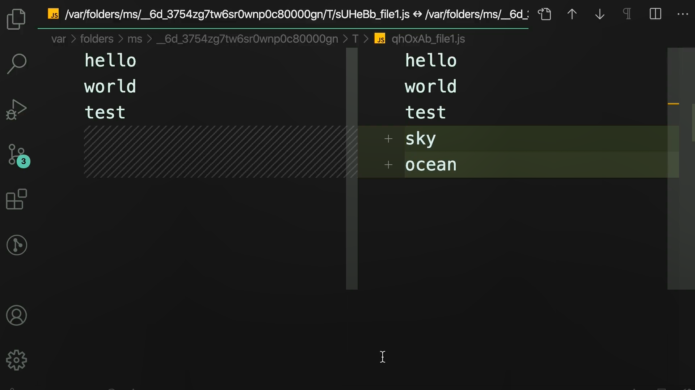
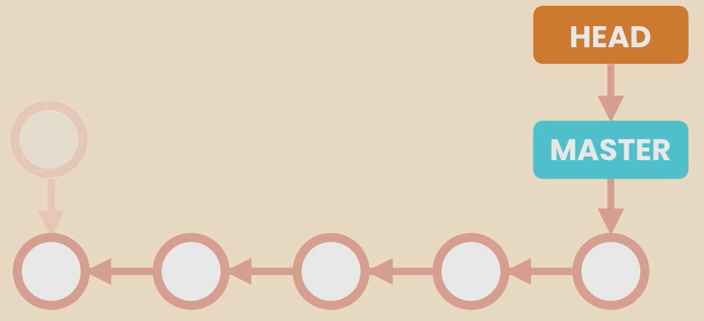

# 📌 Git: The Ultimate Version Control System

## 🔍 What is a Version Control System (VCS)?
A **Version Control System (VCS)** is a tool that helps developers track changes in their code over time, collaborate effectively, and revert to previous versions if needed.

### 📜 Types of Version Control Systems

1. **Centralized Version Control Systems (CVCS)**
   - A single central server holds the entire repository.
   - Developers fetch and commit changes from/to this central repository.
   - Examples:
     - **Subversion (SVN)** 🏛️
     - **Team Foundation Server (TFS)** 💼




2. **Distributed Version Control Systems (DVCS)**
   - Each developer has a full copy of the repository on their local machine.
   - No dependency on a central server; multiple copies ensure backup and flexibility.
   - Examples:
     - **Git** 🏆
     - **Mercurial** 🚀



## 🎯 Why is Git So Popular?
Git is widely used due to several key advantages:
- **Free & Open Source** 🆓💻
- **Super Fast** ⚡
- **Scalable** 🔍 (Works for small and large projects)
- **Branching & Merging Capabilities** 🌿🔀

## 🛠️ Different Ways to Use Git
You can interact with Git using different methods:
1. **Command Line Interface (CLI) 🖥️** - The most powerful and flexible way.
2. **Code Editors & IDEs 🏗️** - Built-in Git support in VS Code, IntelliJ, etc.
3. **Graphical User Interfaces (GUI) 🎨** - Visual tools like GitKraken, SourceTree.

### 🏆 Why is Command Line Preferred?
- **More control over Git features** 🎛️
- **GUI tools have limitations** 🚫
- **GUIs are not always available** (e.g., when working on remote servers) 🌍

## 🔍 Checking Your Git Version
To check if Git is installed on your system, run:
```sh
git --version
```

## ⚙️ Git Configuration (Settings)
Before using Git, you need to configure some settings:

### 🔹 Setting User Information
```sh
git config --global user.name "Sithum Bimsara"
git config --global user.email "sithum.22@cse.mrt.ac.lk"
```
These commands set your name and email, which will be used in your commits.

### 🔹 Setting Default Editor
If you prefer to edit Git messages in VS Code:
```sh
git config --global core.editor "code --wait"
```

### 🔹 Viewing Your Configuration
```sh
git config --global -e
```
This will open your global configuration file for editing.




## 🔍 Levels of Git Configuration
Git settings are applied at different levels:
1. **System Level** 🏢 (Applies to all users on the machine)
2. **Global Level** 🌎 (Applies to all repositories for the current user)
3. **Local Level** 📂 (Applies only to the current repository)

## 📝 Handling Line Endings in Different Operating Systems
## 🔹 What are Line Endings?
Line endings refer to the special characters that indicate the end of a line in a text file. Different operating systems use different conventions:

- **🖥️ Windows:** Uses `\r\n` (Carriage Return + Line Feed)
- **🍎 macOS/Linux:** Uses `\n` (Line Feed only)

These differences can cause issues when sharing files across different operating systems, especially in version control systems like Git.


## 📂 Example: Line Endings Across Different Operating Systems

### **📄 Scenario 1: File Created on Windows**
If you create a file `example.txt` on Windows and write:

```
Hello, World!
This is a test file.
```

Behind the scenes, the file is stored like this (with `\r\n` at the end of each line):

```
Hello, World!\r\n
This is a test file.\r\n
```

### **📄 Scenario 2: File Opened on Linux/macOS**
When the same file is opened on a Linux/macOS system, it may be interpreted differently because Linux expects only `\n` for line endings. If the system doesn’t handle `\r\n` properly, you might see something like:

```
Hello, World!^M
This is a test file.^M
```
(`^M` represents the extra `\r` character.)

This can cause issues in scripts, compilers, or version control.

---

## ⚙️ How Git Handles Line Endings
Git automatically converts line endings based on your system and settings to prevent issues.

### **🛠️ Configuring Git to Handle Line Endings**

#### **🖥️ For Windows Users**
Run the following command to configure Git:
```sh
git config --global core.autocrlf true
```
- ✅ Git will **convert `\n` to `\r\n` when checking out** files.
- ✅ Git will **convert `\r\n` back to `\n` when committing**.

#### **🍎 For Linux/macOS Users**
Run the following command:
```sh
git config --global core.autocrlf input
```
- ✅ Git will **convert `\r\n` to `\n` when committing**, but won’t change anything on checkout.




---

## 🎯 Conclusion
Different line endings can cause issues when switching between operating systems. Git helps by normalizing line endings based on your settings, preventing unnecessary changes in repositories. Configuring Git properly ensures a smooth workflow when working across different environments.


### 🛠️ Configuring Git to Handle Line Endings
- **For Windows:**
  ```sh
  git config --global core.autocrlf true
  ```
  This ensures `\r\n` (Windows format) is converted to `\n` (Unix format) when committing.

- **For macOS/Linux:**
  ```sh
  git config --global core.autocrlf input
  ```
  This keeps line endings unchanged in macOS/Linux but converts `\r\n` to `\n` when committing.

---
💡 Now you're ready to start using Git efficiently! 🚀

---

# 🚀 Git Workflow Explained

## 🔄 Understanding the Git Workflow
Git follows a structured workflow to track changes efficiently. The process involves three main areas:

1. **Working Directory** 📂 - The area where you modify files.
2. **Staging Area (Index)** 🗂️ - Where changes are added before committing.
3. **Repository** 🏛️ - Where committed changes are permanently stored.



### 🛠️ Adding and Committing Changes
```sh
git add file1 file2
```
✅ Moves `file1` and `file2` from the working directory to the staging area.

```sh
git commit -m "Initial Commit"
```
✅ Saves the staged files into the repository.

### 🔄 Modifying a File After Committing
If you modify `file1`, the changes remain only in the **working directory**, not in the staging area or repository.
```sh
git add file1
```
✅ Moves the modified `file1` to the staging area.

```sh
git commit -m "Fixed the bug in file1"
```
✅ Saves the modified `file1` to the repository.

### 🗑️ Removing a File
If you delete `file2` from the working directory, it still exists in the staging area.
To remove it from staging:
```sh
git add file2
```
✅ Now `file2` is marked for deletion.

```sh
git commit -m "Removed file2"
```
✅ Permanently removes `file2` from the repository.

---

## 📂 Initializing a Git Repository
To start tracking a project with Git:

```sh
mkdir Moon  # Create a new directory
cd Moon  # Navigate into the directory
git init  # Initialize Git in the directory
```
✅ Output:
```
Initialized empty Git repository in C:/Users/User/Desktop/projects/GIT MOSH/Moon/.git/
```

### 🔍 Viewing Hidden Files
By default, `.git` (Git's hidden directory) is not shown.

#### On Windows:
```sh
dir  # This will not show .git
```
```sh
dir /a  # Shows .git
```

#### On macOS/Linux:
```sh
ls  # This will not show .git
```
```sh
ls -a  # Shows .git
```

### 📂 Opening the `.git` Directory
To explore Git’s internal structure:
```sh
explorer .git  # Windows
open .git  # macOS/Linux
```

---

## 📜 Example Workflow with `git status`
### 📝 Creating and Tracking Files
```sh
echo hello > file1.txt
echo hello > file2.txt
git status
```
🔴 **Output:** (Untracked files in red)
```
On branch master
No commits yet
Untracked files:
  (use "git add <file>..." to include in what will be committed)
        file1.txt
        file2.txt
```

### ✅ Staging Files
```sh
git add file1.txt file2.txt
git status
```
🟢 **Output:** (Files in green, ready to commit)
```
Changes to be committed:
  (use "git rm --cached <file>..." to unstage)
        new file:   file1.txt
        new file:   file2.txt
```

### 🔄 Modifying a File
```sh
echo world >> file1.txt
git status
```
🔴 **Output:** (File1 modified but not staged in red)
```
Changes not staged for commit:
  (use "git add <file>..." to update what will be committed)
        modified:   file1.txt
```

### 📝 Committing Changes
```sh
git commit -m "Initial Commit"
```
✅ Stores changes in the repository.

### 📌 Staging and Committing Again
```sh
git add .
git status
```
🟢 **Output:** (File1 modified and staged in green)
```
Changes to be committed:
        modified:   file1.txt
```

```sh
git commit
```
✍️ This command opens a text editor (VS Code, Vim, etc.) to enter a descriptive commit message.



```
[master cdab869] A short description.
 1 file changed, 1 insertion(+)
```

---
🎉 **Now you understand the full Git workflow!** 🚀

# 🛠️ Git Scenarios and Command Guide

## 🎯 Skipping the Staging Area

### Command:
```bash
echo test >> file1.txt
```

This appends "test" to `file1.txt`.

### Command:
```bash
git commit -a -m "Fix the bug"
```

### Alternative Command:
```bash
git commit -am "Fix the bug"
```

### Result:
```
[master b0a24b1] Fix the bug
 1 file changed, 1 insertion(+)
```

### ✅ What's happening:
The `-a` flag automatically stages and commits all tracked files, skipping the staging area.

---

## 🗑️ Removing Files

### On Windows:
```bash
del file2.txt
```

### On Linux/macOS:
```bash
rm file2.txt
```

### Check Status:
```bash
git status
```

### Output:
```
Changes not staged for commit:
  (use "git add/rm <file>..." to update what will be committed)
  (use "git restore <file>..." to discard changes in working directory)
        deleted:    file2.txt
```

### Check Files:
```bash
git ls-files
```

### Output:
```
file1.txt
file2.txt
```

### Stage the Deletion:
```bash
git add file2.txt
```

### Verify Staged Changes:
```bash
git ls-files
```
### Output:
```
file1.txt
```

### Commit the Deletion:
```bash
git commit -m "Remove file2.txt"
```

### ✅ Alternative Approach to delete in one go both working directory and staging area:
```bash
git rm file2.txt
```

### Output:
```
rm 'file2.txt'
```

### Commit:
```bash
git commit -m "Remove file2.txt"
```

### View working directory

```bash
dir
```

### Output:
```
03/14/2025  02:45 PM    <DIR>          .
03/14/2025  02:45 PM    <DIR>          ..
               0 File(s)              0 bytes
               2 Dir(s)   8,479,490,048 bytes free
```

As you can see no files in the working directory.

```bash
git status
```
### Output:

```
On branch master
Changes to be committed:
  (use "git restore --staged <file>..." to unstage)
        deleted:    file1.txt
```
---

## 🔄 Renaming Files

### On Windows:
```bash
rename file1.txt main.js
```

### On Linux/macOS:
```bash
mv file1.txt main.js
```

### Check Status:
```bash
git status
```

### Output:

```
On branch master
Changes not staged for commit:
  (use "git add/rm <file>..." to update what will be committed)
  (use "git restore <file>..." to discard changes in working directory)
        deleted:    file1.txt

Untracked files:
  (use "git add <file>..." to include in what will be committed)
        main.js
```


### Stage the Changes:
```bash
git add file1.txt main.js
```

### Check status

```bash
git status
```

### Output:

```
On branch master
Changes to be committed:
  (use "git restore --staged <file>..." to unstage)
        renamed:    file1.txt -> main.js
```
Then git will identify this as a file renaming.


### Commit the Changes:
```bash
git commit -m "Refactor code"
```

### ✅ Alternative Approach to directly rename a file both working directory and staging area in one go:
```bash
git mv main.js file1.txt
```

### Check status

```bash
git status
```
### Output:

```
On branch master
Changes to be committed:
  (use "git restore --staged <file>..." to unstage)
        renamed:    main.js -> file1.txt
```

---

## 🛑 Ignoring Files

### Create Directory and File:
```bash
mkdir logs
```
```bash
echo "hello" > logs/dev.log
```

### Check Status:
```bash
git status
```
### Output:

```
On branch master
Untracked files:
  (use "git add <file>..." to include in what will be committed)
        logs/

nothing added to commit but untracked files present (use "git add" to track)
```


### Add to .gitignore:
```bash
echo logs/ > .gitignore
```



### Stage and Commit:
```bash
git add .gitignore
```
```bash
git commit -m "Add gitignore"
```

---

## 🚫 Removing an Unwanted Staged File

When we accidently add a unwanted file into staging area, we should have to remove it from staging area too, otherwise if we add that file to .gitignore that files also will be go to staging area, although that file name also included in .gitignore.

### Create a Directory and a File:
```bash
mkdir bin
```
```bash
echo "hello" > bin/app.bin
```

### Add and Commit the File:
```bash
git add .
```
```bash
git commit -m "Add bin"
```

### Add to .gitignore:
```bash
echo bin/ > .gitignore
```

```bash
git commit -m "Include bin directory to .gitignore"
```

### Append "helloworld" to app.bin

```bash
echo hellworld >> bin\app.bin()
```

### View status

```bash
git status
```

### Output:

```
On branch master
Changes not staged for commit:
  (use "git add <file>..." to update what will be committed)
  (use "git restore <file>..." to discard changes in working directory)
        modified:   bin/app.bin

no changes added to commit (use "git add" and/or "git commit -a")
```
**As you can see the above output our intension was not completed yet, If we want to don't add the changes we make to bin folder to staging area , git is still tracking that folder.**

### View files in staging area

```bash
git ls-files
```

### Output:

```
.gitignore
bin/app.bin
file1.txt
logs/dev.log
```

### Remove that bin directory Staging Area:
```bash
git rm --cached -r bin/
```

### View files in staging area

```bash
git ls-files
```

### Output:

```
.gitignore
file1.txt
logs/dev.log
```

### View status

```bash
git status
```


### Output:

```
On branch master
Changes to be committed:
  (use "git restore --staged <file>..." to unstage)
        deleted:    bin/app.bin
```

### Commit the Removal:
```bash
git commit -m "Remove the bin directory that was accidentally committed"
```

--------------

## 1️⃣ Short Status (`git status -s`)

### Output:
```
?? file0.js
A  file1.js
AM file2.js
```
### Explanation:
- `??` → Untracked files (new files not yet added to Git)
- `A` → Newly added file to staging
- `AM` → A file that was added (`A`) and then modified (`M`) before committing
- Red `M` → Modified file but not yet staged
- Green `M` → Modified file that has been staged
- Green `A` → Newly added file to the staging area

## 2️⃣ Viewing Staged and Unstaged Files (`git diff` and `git diff --staged`)
### `git diff --staged`

#### Output:
```
diff --git a/file1.js b/file1.js
index 7436f3f..6fdbffe 100644
--- a/file1.js
+++ b/file1.js
@@ -3,3 +3,5 @@ hello
 hello
 hello
 hello
+hello
+hello
```
### Explanation:
- `diff --git a/file1.js b/file1.js` → Shows differences between two versions of `file1.js`
- `index 7436f3f..6fdbffe 100644` → SHA index of the file before and after
- `--- a/file1.js` → Old version
- `+++ b/file1.js` → New version
- `@@ -3,3 +3,5 @@` → Context of the changes
- `+hello` → New lines added

### `git diff`
#### Output:
```
index 6fdbffe..d29bf5e 100644
--- a/file1.js
+++ b/file1.js
@@ -5,3 +5,5 @@ hello
 hello
 hello
 hello
+hello
+hello
```
### Explanation:
- Shows changes in the working directory (unstaged changes)

## 3️⃣ Diff Tools (KDiff3, P4Merge, WinMerge, VSCode)
### Configuring VSCode as the Default Diff Tool
```bash
git config --global diff.tool vscode
git config --global difftool.vscode.cmd "code --wait --diff $LOCAL $REMOTE"
```
```bash
git config --global -e
```

### `git config --global -e` Output:
```
[user]
	name = Sithum Bimsara
	email = sithim.22@cse.mrt.ac.lk
[core]
	editor = code --wait
	autocrlf = true
[diff]
	tool = vscode
[difftool "vscode"]
	cmd = code --wait --diff $LOCAL $REMOTE
[safe]
	directory = C:/Users/User/Desktop/projects/50+GenAIProjects
```
### Explanation:
- `[user]` → User information
- `[core]` → Default editor settings
- `[diff]` → Specifies VSCode as the default diff tool
- `[difftool "vscode"]` → Command to launch VSCode in diff mode

## Visual Diff Tools

 ```bash
git difftool
```
🔹 Purpose:

Compares the working directory with the latest committed version (HEAD).
Opens an external diff tool (e.g., VS Code, Meld, Beyond Compare).

🔹 Example Usage:

If you modified file1.txt but haven't committed it yet, running:

```bash
git difftool
```

will open file1.txt in your configured diff tool, showing changes against the last committed version.

 ```bash
git difftool --staged
```

🔹 Purpose:

Compares staged changes (added with git add) against the last committed version.
Useful for reviewing changes before committing.

🔹 Example Usage:

Modify a file:

```bash
echo "sky" >> file1.txt
echo "ocean" >> file1.txt
```

Stage it:
```bash
git add file1.txt
```

Run:
```bash
git difftool --staged
```
This shows differences between staged changes and the last commit.




## 4️⃣ Viewing History
### `git log`
#### Output:
```
commit 2164f6310e417ad5e988be02814e268f515683e2 (HEAD -> master)
Author: Sithum Bimsara <sithim.22@cse.mrt.ac.lk>
Date:   Sat Mar 15 09:10:29 2025 +0530

    File 1 changed

commit 6e3f75779d40f821b5a831845e51d2e1dff1b918
Author: Sithum Bimsara <sithim.22@cse.mrt.ac.lk>
Date:   Sat Mar 15 09:06:24 2025 +0530

    File added
```
### Explanation:
- `commit <hash>` → Unique ID of the commit
- `HEAD -> master` → Current branch
- `Author` → Committer's details
- `Date` → Timestamp of the commit
- `Message` → Short description of the commit

### `git log --oneline`

### Explanation:
- Displays commits in a compact format

#### Output:
```
2164f63 (HEAD -> master) File 1 changed
6e3f757 File added
```


## 5️⃣ Viewing a Commit
### `git show d601b90`
- Shows detailed information about a specific commit

### `git show HEAD`
- Shows the latest commit

### `git show HEAD~1`
- Shows the commit before the latest one

### `git ls-tree HEAD~1`
- Lists files and directories in a previous commit

## 6️⃣ Git Objects

**Git is a distributed version control system that stores data as a series of objects in a repository's .git/objects directory. These objects help track changes efficiently.**

Git objects include:
- **Commits** → Record of changes
- **Blobs** → Store file content
- **Trees** → Store directory structures
- **Tags** → References to specific commits

## 7️⃣ Unstaging Files (`git restore`)

### Explanation:
- Moves files from staging to the working directory


### Commands:
```bash
git restore --staged file1.js
git restore --staged file1.js file2.txt
git restore --staged *.txt
git restore --staged .
git status -s
```


## 8️⃣ Discarding Local Changes
### Commands:
```bash
git restore file1.js
git restore .
git status -s
git clean -fd
git status -s
```
### Explanation:
- `git restore file1.js` → Discards changes in `file1.js`
- `git restore .` → Discards all changes
- `git clean -fd` → Removes untracked files and directories

## 9️⃣ Restoring a File to an Earlier Version
### Command:
```bash
git restore --source=HEAD~1 file1.js
```
### Explanation:
- Restores `file1.js` to its previous commit version

---
🛠️ This guide covers essential Git operations to help you manage your project efficiently! 🚀

## Git Log Analysis and Filtering 🚀

This guide provides a comprehensive understanding of Git log commands and their outputs, ensuring a clear and structured approach to Git history tracking.

---

### 🔍 Viewing Git History

#### `git log`

**Output:**
```
commit 16eab60108a23d7adb5004fc2d18285db0fa2a70 (HEAD -> master)
Author: Sithum Bimsara <sithim.22@cse.mrt.ac.lk>
Date:   Sat Mar 15 11:51:35 2025 +0530

    Hello Sithum World added

commit 14f4275fd928bbf5f06b918496461a05ba506419
Author: Sithum Bimsara <sithim.22@cse.mrt.ac.lk>
Date:   Sat Mar 15 11:49:58 2025 +0530

    Deleted all
```

📌 **Explanation:**
- Displays the commit history in full detail.
- Each commit includes a **commit hash**, **author**, **date**, and **commit message**.

---

#### `git log --oneline`

**Output:**
```
16eab60 (HEAD -> master) Hello Sithum World added
14f4275 Deleted all
da3d1b1 2worlds added
2164f63 File 1 changed
6e3f757 File added
```

📌 **Explanation:**
- Shows a summarized one-line version of the commit history.
- The commit hash is shortened for better readability.

---

#### `git log --oneline --stat`

**Output:**
```
16eab60 (HEAD -> master) Hello Sithum World added
 file1.js | 3 +++
 1 file changed, 3 insertions(+)
14f4275 Deleted all
 file1.js | 9 ---------
 file2.js | 3 +++
 2 files changed, 3 insertions(+), 9 deletions(-)
```

📌 **Explanation:**
- Displays the number of files changed, insertions (`+`), and deletions (`-`) in each commit.

---

#### `git log --stat`

**Output:**
```
commit 16eab60108a23d7adb5004fc2d18285db0fa2a70 (HEAD -> master)
Author: Sithum Bimsara <sithim.22@cse.mrt.ac.lk>
Date:   Sat Mar 15 11:51:35 2025 +0530

    Hello Sithum World added

 file1.js | 3 +++
 1 file changed, 3 insertions(+)
```

📌 **Explanation:**
- Displays detailed commit history with file changes and statistics.

---

### 🔍 Filtering Git History

#### `git log --oneline -3`
- Shows the last **3 commits**.

#### `git log --oneline --author="Sithum"`
- Filters commits by **author**.

#### `git log --oneline --after="2025-01-13"`
- Displays commits made **after** a specific date.

#### `git log --oneline --grep="File"`
- Filters commits with a **case-sensitive** search in messages.

#### `git log --oneline -S"hello"`
- Displays commits that have **added or removed** "hello".

#### `git log --oneline file1.js`
- Shows commit history for **file1.js** only.

---

### 🎨 Formatting the Log Output

#### `git log --pretty=format:"%an commited %h on %cd"`

**Output:**
```
Sithum Bimsara commited 16eab60 on Sat Mar 15 11:51:35 2025 +0530
Sithum Bimsara commited 14f4275 on Sat Mar 15 11:49:58 2025 +0530
```

📌 **Explanation:**
- Custom formatting using `%an` (author), `%h` (short hash), and `%cd` (commit date).

---

### 🎨 Adding Colors

#### `git log --pretty=format:"%Cgreen%an%Creset commited %h on %cd"`

📌 **Explanation:**
- Adds **green** color to the author name for better readability.

---

This guide provides a structured approach to exploring Git history efficiently! 🚀


---

🎉 **Now you've mastered these essential Git scenarios!**

# 📌 View Commits

## 🔗 Creating Git Aliases
Git aliases allow us to create shortcuts for commonly used commands.

### 🔹 Define a new alias
```bash
git config --global alias.lg "log --pretty=format:'%an committed %h'"
```
✅ This command sets `git lg` as a shortcut for viewing commit logs in a compact format, displaying the author's name and commit hash.

### 🔹 Using the alias
```bash
git lg
```
📌 Output:
```
Sithum Bimsara committed 16eab60
Sithum Bimsara committed 14f4275
Sithum Bimsara committed da3d1b1
Sithum Bimsara committed 2164f63
Sithum Bimsara committed 6e3f757
```

### 🔹 Alias for unstaging changes
```bash
git config --global alias.unstage "restore --staged ."
```
✅ Now we can use `git unstage` instead of `git restore --staged .` to unstage files easily.

---

## 🔍 Viewing a Specific Commit

### 🔹 Show commit details
```bash
git show HEAD~2
```
✅ This command moves two commits back from the latest commit (HEAD) and shows the details.

### 🔹 Show specific file in a commit
```bash
git show HEAD~2:path/to/file
```
✅ This command shows the state of a specific file at a commit two steps back.

📌 **How to declare the path?**
- The path should be relative to the Git repository root.
- Example:
```bash
git show HEAD~2:src/index.js
```

### 🔹 Show only filenames changed in a commit
```bash
git show HEAD~2 --name-only
```
📌 Output:
```
commit 14f4275fd928bbf5f06b918496461a05ba506419
Author: Sithum Bimsara <sithim.22@cse.mrt.ac.lk>
Date:   Sat Mar 15 11:49:58 2025 +0530

    Deleted all

file1.js
file2.js
```

### 🔹 Show filenames with their statuses
```bash
git show HEAD~2 --name-status
```
📌 Output:
```
commit 14f4275fd928bbf5f06b918496461a05ba506419
Author: Sithum Bimsara <sithim.22@cse.mrt.ac.lk>
Date:   Sat Mar 15 11:49:58 2025 +0530

    Deleted all

M       file1.js
M       file2.js
```
ℹ️ `M` means the file was modified.

---

## 🔄 Viewing Changes Across Commits

### 🔹 Show differences between commits
```bash
git diff HEAD~2 HEAD
```
📌 Output:
```
diff --git a/file1.js b/file1.js
index 470dc38..39db52e 100644
--- a/file1.js
+++ b/file1.js
@@ -1,3 +1,4 @@
 Hello
 Sithum
-World
\ No newline at end of file
+World
+Bimsara
\ No newline at end of file

diff --git a/file2.js b/file2.js
index 8daf0ad..2e4eee7 100644
--- a/file2.js
+++ b/file2.js
@@ -3,3 +3,4 @@
 world
 world
 hello
 hello
+James
```

### 🔹 Show changes of a specific file
```bash
git diff HEAD~2 HEAD file1.js
```
📌 Output:
```
diff --git a/file1.js b/file1.js
index 470dc38..39db52e 100644
--- a/file1.js
+++ b/file1.js
@@ -1,3 +1,4 @@
 Hello
 Sithum
-World
\ No newline at end of file
+World
+Bimsara
\ No newline at end of file
```

### 🔹 Show only filenames of changed files
```bash
git diff HEAD~2 HEAD --name-only
```
📌 Output:
```
file1.js
file2.js
```

### 🔹 Show filenames with statuses
```bash
git diff HEAD~2 HEAD --name-status
```
📌 Output:
```
M       file1.js
M       file2.js
```
✅ `M` indicates the files were modified.

---

🎉 With these commands, you can efficiently navigate Git history, track changes, and optimize your workflow! 🚀

# 🧐 Understanding Detached HEAD in Git

## 🛤️ Viewing the Complete Snapshot of a Commit

When working with Git, sometimes you want to view the complete snapshot of your project at a specific point in time. This is done by checking out a given commit. This action restores your working directory to the snapshot stored in that commit, allowing you to see how your project looked at that moment.

### 🎯 Command to Checkout a Commit
```bash
# Copy the commit ID from the log
$ git log

# Run the checkout command
$ git checkout <commit-id>
```

📌 Output

```
Note: switching to '14f4275'.

You are in 'detached HEAD' state. You can look around, make experimental
changes and commit them, and you can discard any commits you make in this
state without impacting any branches by switching back to a branch.

If you want to create a new branch to retain commits you create, you may
do so (now or later) by using -c with the switch command. Example:

  git switch -c <new-branch-name>

Or undo this operation with:

  git switch -

Turn off this advice by setting config variable advice.detachedHead to false

HEAD is now at 14f4275 Deleted all
```


### ⚠️ Warning: Detached HEAD State
When you check out a commit, Git warns you that you are in a **detached HEAD state**. This sounds intimidating, but it’s actually simple.


**Now you use `git log --online` you only can view only the changes before the above commit.

📌 Output

```
14f4275 (HEAD) Deleted all
da3d1b1 2worlds added
2164f63 File 1 changed
6e3f757 File added
```

### 📋 To View All Commits (Including Hidden Ones)
```bash
$ git log --oneline --all
```

📌 Output

```
4ce9343 (master) All commited
df9b461 James added to file2
befda4c Bimsara added to file1
16eab60 Hello Sithum World added
14f4275 (HEAD) Deleted all
da3d1b1 2worlds added
2164f63 File 1 changed
6e3f757 File added
```
**But as you can see in the output **HEAD** and **master** are seperated. 

## 🌳 Git’s Commit Structure
- Each commit points to the previous commit, forming a chain.


- These commits are part of the **master branch**, the main line of work.


- Git represents branches using a pointer. For example, the **master pointer** points to the latest commit.
- The **HEAD pointer** tells Git which branch you're currently working on.


### 🛤️ How HEAD Works
- When you create new commits, both the **master pointer** and **HEAD pointer** move forward.


- When you check out a specific commit, the **HEAD pointer** moves to that commit, but it’s no longer attached to any branch. This is called the **detached HEAD state**.

## 🧐 What Happens in Detached HEAD State?
- You can view the code at that point in time.
- ❌ **Do NOT create new commits** because those commits will be **unreachable** and eventually deleted by Git to save space.

### 🛑 Why Shouldn't You Create Commits?
If you create a new commit in the detached HEAD state:
- The commit is not part of any branch.
- It becomes a **dangling commit** and will be deleted by Git during garbage collection.



## 🧐 How to Return to Normal State?
To exit the detached HEAD state and return to the master branch:
```bash
$ git checkout master
```

### 📋 Viewing All Commits (Including Hidden Ones)
```bash
$ git log --oneline --all
```

### 🎯 Visual Representation
```
master ----> commit1 ----> commit2 ----> commit3 ----> commit4 (HEAD)
```

## 🌟 Summary
| Action                        | State                   |
|--------------------------------|---------------------|
| Checkout a commit             | Detached HEAD        |
| Create new commits            | Risk of losing them |
| Return to master branch       | `git checkout master` |
| View all commits              | `git log --oneline --all` |

✅ **Key Takeaway:** Use detached HEAD to explore past code, not to make changes!

## 🛠 Finding Contributions

### 🔍 Checking Individual Contributions

Git provides the `git shortlog` command to summarize contributions made by each author. Here’s an example:

```bash
git shortlog
```

### 📜 Sample Output:
```bash
Sithum-Bimsara (4):
      Create README.md
      Update README.md
      Merge pull request #19 from Sithum-Bimsara/feature/backend/v1
      Merge pull request #21 from Sithum-Bimsara/front-end

Dulitha Perera (3):
      Merge pull request #1 from Sithum-Bimsara/feature/backend/v1
      Add functions to feedback model
      Fix an error and create feedback controller

Sasmitha Uvindu Jayasinghe (3):
      Started creating front end
      Merge pull request #11 from Sithum-Bimsara/feature/backend/v1
      updated the header
```

### 📊 Counting Contributions by Authors

```bash
git shortlog -n -s
```

### 📜 Output:
```bash
   17  Sithum Bimsara
   13  Sasmitha Uvindu Jayasinghe
    8  Dulitha Perera
```

The `-n` option sorts authors by the number of commits, and `-s` shows only the commit count.

---

## 🔄 Restoring a Deleted File

If you accidentally delete a file in Git, you can restore it. Let’s see a real-world scenario:

### 🗑 Deleting a File
```bash
git rm file1.js
```

### 📜 Output:
```bash
rm 'file1.js'
```

### 💾 Committing the Deletion
```bash
git commit -m "Remove file1.js"
```

### 🔍 Finding the Last Commit Containing the File
```bash
git log --oneline -- file1.js
```

### 📜 Output:
```bash
5f28a5d (HEAD -> master) Remove file1.js
4ce9343 All committed
...
```

### ♻ Restoring the File from a Previous Commit
```bash
git checkout 4ce9343 file1.js
```

### ✅ Committing the Restoration
```bash
git commit -m "Restore file1.js"
```

### 🎯 Final Check
```bash
git status
```
```bash
On branch master
nothing to commit, working tree clean
```

---

## 🏷 Finding the Author of a Line (Blame)

The `git blame` command helps identify who made changes to specific lines of a file.

### 🔍 Checking Line-by-Line History
```bash
git blame file1.js
```

### 📜 Output:
```bash
76f9ff77 (Sithum Bimsara 2025-03-17 22:12:03 +0530 1) Hello
76f9ff77 (Sithum Bimsara 2025-03-17 22:12:03 +0530 2) Sithum
76f9ff77 (Sithum Bimsara 2025-03-17 22:12:03 +0530 3) World
```

You can also check with email details:
```bash
git blame -e file1.js
```

### 📜 Output:
```bash
76f9ff77 (<sithim.22@cse.mrt.ac.lk> 2025-03-17 22:12:03 +0530 1) Hello
```

---

## 🏷 Git Tagging

### 🔖 Creating a Lightweight Tag
```bash
git tag v1.0 14f4275
```

### 🔍 Viewing Tags
```bash
git tag
```
```bash
v1.0
```

### 🔍 Viewing Tag Details
```bash
git show v1.0
```

### 🏷 Creating an Annotated Tag
```bash
git tag -a v1.1 -m "My version 1.1"
```

### 📜 Viewing Tags with Messages
```bash
git tag -n
```
```bash
v1.0 Deleted all
v1.1 My version 1.1
```

### 🚀 Checking Out a Tag
```bash
git checkout v1.0
```

### 🗑 Deleting a Tag
```bash
git tag -d v1.1
```

```bash
Deleted tag 'v1.1' (was 464b228)
```

---

This provides a comprehensive understanding of commonly used Git operations, making version control more efficient and reliable. 🚀


