# 📌 Git: The Ultimate Version Control System

## 🔍 What is a Version Control System (VCS)?
A **Version Control System (VCS)** is a tool that helps developers track changes in their code over time, collaborate effectively, and revert to previous versions if needed.

### 📜 Types of Version Control Systems

1. **Centralized Version Control Systems (CVCS)**
   - A single central server holds the entire repository.
   - Developers fetch and commit changes from/to this central repository.
   - Examples:
     - **Subversion (SVN)** 🏛️
     - **Team Foundation Server (TFS)** 💼


2. **Distributed Version Control Systems (DVCS)**
   - Each developer has a full copy of the repository on their local machine.
   - No dependency on a central server; multiple copies ensure backup and flexibility.
   - Examples:
     - **Git** 🏆
     - **Mercurial** 🚀


## 🎯 Why is Git So Popular?
Git is widely used due to several key advantages:
- **Free & Open Source** 🆓💻
- **Super Fast** ⚡
- **Scalable** 🔍 (Works for small and large projects)
- **Branching & Merging Capabilities** 🌿🔀

## 🛠️ Different Ways to Use Git
You can interact with Git using different methods:
1. **Command Line Interface (CLI) 🖥️** - The most powerful and flexible way.
2. **Code Editors & IDEs 🏗️** - Built-in Git support in VS Code, IntelliJ, etc.
3. **Graphical User Interfaces (GUI) 🎨** - Visual tools like GitKraken, SourceTree.

### 🏆 Why is Command Line Preferred?
- **More control over Git features** 🎛️
- **GUI tools have limitations** 🚫
- **GUIs are not always available** (e.g., when working on remote servers) 🌍

## 🔍 Checking Your Git Version
To check if Git is installed on your system, run:
```sh
git --version
```

## ⚙️ Git Configuration (Settings)
Before using Git, you need to configure some settings:

### 🔹 Setting User Information
```sh
git config --global user.name "Sithum Bimsara"
git config --global user.email "sithum.22@cse.mrt.ac.lk"
```
These commands set your name and email, which will be used in your commits.

### 🔹 Setting Default Editor
If you prefer to edit Git messages in VS Code:
```sh
git config --global core.editor "code --wait"
```

### 🔹 Viewing Your Configuration
```sh
git config --global -e
```
This will open your global configuration file for editing.


## 🔍 Levels of Git Configuration
Git settings are applied at different levels:
1. **System Level** 🏢 (Applies to all users on the machine)
2. **Global Level** 🌎 (Applies to all repositories for the current user)
3. **Local Level** 📂 (Applies only to the current repository)

## 📝 Handling Line Endings in Different Operating Systems
## 🔹 What are Line Endings?
Line endings refer to the special characters that indicate the end of a line in a text file. Different operating systems use different conventions:

- **🖥️ Windows:** Uses `\r\n` (Carriage Return + Line Feed)
- **🍎 macOS/Linux:** Uses `\n` (Line Feed only)

These differences can cause issues when sharing files across different operating systems, especially in version control systems like Git.


## 📂 Example: Line Endings Across Different Operating Systems

### **📄 Scenario 1: File Created on Windows**
If you create a file `example.txt` on Windows and write:

```
Hello, World!
This is a test file.
```

Behind the scenes, the file is stored like this (with `\r\n` at the end of each line):

```
Hello, World!\r\n
This is a test file.\r\n
```

### **📄 Scenario 2: File Opened on Linux/macOS**
When the same file is opened on a Linux/macOS system, it may be interpreted differently because Linux expects only `\n` for line endings. If the system doesn’t handle `\r\n` properly, you might see something like:

```
Hello, World!^M
This is a test file.^M
```
(`^M` represents the extra `\r` character.)

This can cause issues in scripts, compilers, or version control.

---

## ⚙️ How Git Handles Line Endings
Git automatically converts line endings based on your system and settings to prevent issues.

### **🛠️ Configuring Git to Handle Line Endings**

#### **🖥️ For Windows Users**
Run the following command to configure Git:
```sh
git config --global core.autocrlf true
```
- ✅ Git will **convert `\n` to `\r\n` when checking out** files.
- ✅ Git will **convert `\r\n` back to `\n` when committing**.

#### **🍎 For Linux/macOS Users**
Run the following command:
```sh
git config --global core.autocrlf input
```
- ✅ Git will **convert `\r\n` to `\n` when committing**, but won’t change anything on checkout.


---

## 🎯 Conclusion
Different line endings can cause issues when switching between operating systems. Git helps by normalizing line endings based on your settings, preventing unnecessary changes in repositories. Configuring Git properly ensures a smooth workflow when working across different environments.


### 🛠️ Configuring Git to Handle Line Endings
- **For Windows:**
  ```sh
  git config --global core.autocrlf true
  ```
  This ensures `\r\n` (Windows format) is converted to `\n` (Unix format) when committing.

- **For macOS/Linux:**
  ```sh
  git config --global core.autocrlf input
  ```
  This keeps line endings unchanged in macOS/Linux but converts `\r\n` to `\n` when committing.

---
💡 Now you're ready to start using Git efficiently! 🚀

---

# 🚀 Git Workflow Explained

## 🔄 Understanding the Git Workflow
Git follows a structured workflow to track changes efficiently. The process involves three main areas:

1. **Working Directory** 📂 - The area where you modify files.
2. **Staging Area (Index)** 🗂️ - Where changes are added before committing.
3. **Repository** 🏛️ - Where committed changes are permanently stored.


### 🛠️ Adding and Committing Changes
```sh
git add file1 file2
```
✅ Moves `file1` and `file2` from the working directory to the staging area.

```sh
git commit -m "Initial Commit"
```
✅ Saves the staged files into the repository.

### 🔄 Modifying a File After Committing
If you modify `file1`, the changes remain only in the **working directory**, not in the staging area or repository.
```sh
git add file1
```
✅ Moves the modified `file1` to the staging area.

```sh
git commit -m "Fixed the bug in file1"
```
✅ Saves the modified `file1` to the repository.

### 🗑️ Removing a File
If you delete `file2` from the working directory, it still exists in the staging area.
To remove it from staging:
```sh
git add file2
```
✅ Now `file2` is marked for deletion.

```sh
git commit -m "Removed file2"
```
✅ Permanently removes `file2` from the repository.

---

## 📂 Initializing a Git Repository
To start tracking a project with Git:

```sh
mkdir Moon  # Create a new directory
cd Moon  # Navigate into the directory
git init  # Initialize Git in the directory
```
✅ Output:
```
Initialized empty Git repository in C:/Users/User/Desktop/projects/GIT MOSH/Moon/.git/
```

### 🔍 Viewing Hidden Files
By default, `.git` (Git's hidden directory) is not shown.

#### On Windows:
```sh
dir  # This will not show .git
```
```sh
dir /a  # Shows .git
```

#### On macOS/Linux:
```sh
ls  # This will not show .git
```
```sh
ls -a  # Shows .git
```

### 📂 Opening the `.git` Directory
To explore Git’s internal structure:
```sh
explorer .git  # Windows
open .git  # macOS/Linux
```

---

## 📜 Example Workflow with `git status`
### 📝 Creating and Tracking Files
```sh
echo hello > file1.txt
echo hello > file2.txt
git status
```
🔴 **Output:** (Untracked files in red)
```
On branch master
No commits yet
Untracked files:
  (use "git add <file>..." to include in what will be committed)
        file1.txt
        file2.txt
```

### ✅ Staging Files
```sh
git add file1.txt file2.txt
git status
```
🟢 **Output:** (Files in green, ready to commit)
```
Changes to be committed:
  (use "git rm --cached <file>..." to unstage)
        new file:   file1.txt
        new file:   file2.txt
```

### 🔄 Modifying a File
```sh
echo world >> file1.txt
git status
```
🔴 **Output:** (File1 modified but not staged in red)
```
Changes not staged for commit:
  (use "git add <file>..." to update what will be committed)
        modified:   file1.txt
```

### 📝 Committing Changes
```sh
git commit -m "Initial Commit"
```
✅ Stores changes in the repository.

### 📌 Staging and Committing Again
```sh
git add .
git status
```
🟢 **Output:** (File1 modified and staged in green)
```
Changes to be committed:
        modified:   file1.txt
```

```sh
git commit
```
✍️ This command opens a text editor (VS Code, Vim, etc.) to enter a descriptive commit message.


```
[master cdab869] A short description.
 1 file changed, 1 insertion(+)
```

---
🎉 **Now you understand the full Git workflow!** 🚀

# 🛠️ Git Scenarios and Command Guide

## 🎯 Skipping the Staging Area

### Command:
```bash
echo test >> file1.txt
```

This appends "test" to `file1.txt`.

### Command:
```bash
git commit -a -m "Fix the bug"
```

### Alternative Command:
```bash
git commit -am "Fix the bug"
```

### Result:
```
[master b0a24b1] Fix the bug
 1 file changed, 1 insertion(+)
```

### ✅ What's happening:
The `-a` flag automatically stages and commits all tracked files, skipping the staging area.

---

## 🗑️ Removing Files

### On Windows:
```bash
del file2.txt
```

### On Linux/macOS:
```bash
rm file2.txt
```

### Check Status:
```bash
git status
```

### Output:
```
Changes not staged for commit:
  (use "git add/rm <file>..." to update what will be committed)
  (use "git restore <file>..." to discard changes in working directory)
        deleted:    file2.txt
```

### Check Files:
```bash
git ls-files
```

### Output:
```
file1.txt
file2.txt
```

### Stage the Deletion:
```bash
git add file2.txt
```

### Verify Staged Changes:
```bash
git ls-files
```
### Output:
```
file1.txt
```

### Commit the Deletion:
```bash
git commit -m "Remove file2.txt"
```

### ✅ Alternative Approach to delete in one go both working directory and staging area:
```bash
git rm file2.txt
```

### Output:
```
rm 'file2.txt'
```

### Commit:
```bash
git commit -m "Remove file2.txt"
```

### View working directory

```bash
dir
```

### Output:
```
03/14/2025  02:45 PM    <DIR>          .
03/14/2025  02:45 PM    <DIR>          ..
               0 File(s)              0 bytes
               2 Dir(s)   8,479,490,048 bytes free
```

As you can see no files in the working directory.

```bash
git status
```
### Output:

```
On branch master
Changes to be committed:
  (use "git restore --staged <file>..." to unstage)
        deleted:    file1.txt
```
---

## 🔄 Renaming Files

### On Windows:
```bash
rename file1.txt main.js
```

### On Linux/macOS:
```bash
mv file1.txt main.js
```

### Check Status:
```bash
git status
```

### Output:

```
On branch master
Changes not staged for commit:
  (use "git add/rm <file>..." to update what will be committed)
  (use "git restore <file>..." to discard changes in working directory)
        deleted:    file1.txt

Untracked files:
  (use "git add <file>..." to include in what will be committed)
        main.js
```


### Stage the Changes:
```bash
git add file1.txt main.js
```

### Check status

```bash
git status
```

### Output:

```
On branch master
Changes to be committed:
  (use "git restore --staged <file>..." to unstage)
        renamed:    file1.txt -> main.js
```
Then git will identify this as a file renaming.


### Commit the Changes:
```bash
git commit -m "Refactor code"
```

### ✅ Alternative Approach to directly rename a file both working directory and staging area in one go:
```bash
git mv main.js file1.txt
```

### Check status

```bash
git status
```
### Output:

```
On branch master
Changes to be committed:
  (use "git restore --staged <file>..." to unstage)
        renamed:    main.js -> file1.txt
```

---

## 🛑 Ignoring Files

### Create Directory and File:
```bash
mkdir logs
```
```bash
echo "hello" > logs/dev.log
```

### Check Status:
```bash
git status
```
### Output:

```
On branch master
Untracked files:
  (use "git add <file>..." to include in what will be committed)
        logs/

nothing added to commit but untracked files present (use "git add" to track)
```


### Add to .gitignore:
```bash
echo logs/ > .gitignore
```


### Stage and Commit:
```bash
git add .gitignore
```
```bash
git commit -m "Add gitignore"
```

---

## 🚫 Removing an Unwanted Staged File

When we accidently add a unwanted file into staging area, we should have to remove it from staging area too, otherwise if we add that file to .gitignore that files also will be go to staging area, although that file name also included in .gitignore.

### Create a Directory and a File:
```bash
mkdir bin
```
```bash
echo "hello" > bin/app.bin
```

### Add and Commit the File:
```bash
git add .
```
```bash
git commit -m "Add bin"
```

### Add to .gitignore:
```bash
echo bin/ > .gitignore
```

```bash
git commit -m "Include bin directory to .gitignore"
```

### Append "helloworld" to app.bin

```bash
echo hellworld >> bin\app.bin()
```

### View status

```bash
git status
```

### Output:

```
On branch master
Changes not staged for commit:
  (use "git add <file>..." to update what will be committed)
  (use "git restore <file>..." to discard changes in working directory)
        modified:   bin/app.bin

no changes added to commit (use "git add" and/or "git commit -a")
```
**As you can see the above output our intension was not completed yet, If we want to don't add the changes we make to bin folder to staging area , git is still tracking that folder.**

### View files in staging area

```bash
git ls-files
```

### Output:

```
.gitignore
bin/app.bin
file1.txt
logs/dev.log
```

### Remove that bin directory Staging Area:
```bash
git rm --cached -r bin/
```

### View files in staging area

```bash
git ls-files
```

### Output:

```
.gitignore
file1.txt
logs/dev.log
```

### View status

```bash
git status
```


### Output:

```
On branch master
Changes to be committed:
  (use "git restore --staged <file>..." to unstage)
        deleted:    bin/app.bin
```

### Commit the Removal:
```bash
git commit -m "Remove the bin directory that was accidentally committed"
```

--------------

## 1️⃣ Short Status (`git status -s`)

### Output:
```
?? file0.js
A  file1.js
AM file2.js
```
### Explanation:
- `??` → Untracked files (new files not yet added to Git)
- `A` → Newly added file to staging
- `AM` → A file that was added (`A`) and then modified (`M`) before committing
- Red `M` → Modified file but not yet staged
- Green `M` → Modified file that has been staged
- Green `A` → Newly added file to the staging area

## 2️⃣ Viewing Staged and Unstaged Files (`git diff` and `git diff --staged`)
### `git diff --staged`

#### Output:
```
diff --git a/file1.js b/file1.js
index 7436f3f..6fdbffe 100644
--- a/file1.js
+++ b/file1.js
@@ -3,3 +3,5 @@ hello
 hello
 hello
 hello
+hello
+hello
```
### Explanation:
- `diff --git a/file1.js b/file1.js` → Shows differences between two versions of `file1.js`
- `index 7436f3f..6fdbffe 100644` → SHA index of the file before and after
- `--- a/file1.js` → Old version
- `+++ b/file1.js` → New version
- `@@ -3,3 +3,5 @@` → Context of the changes
- `+hello` → New lines added

### `git diff`
#### Output:
```
index 6fdbffe..d29bf5e 100644
--- a/file1.js
+++ b/file1.js
@@ -5,3 +5,5 @@ hello
 hello
 hello
 hello
+hello
+hello
```
### Explanation:
- Shows changes in the working directory (unstaged changes)

## 3️⃣ Diff Tools (KDiff3, P4Merge, WinMerge, VSCode)
### Configuring VSCode as the Default Diff Tool
```bash
git config --global diff.tool vscode
git config --global difftool.vscode.cmd "code --wait --diff $LOCAL $REMOTE"
```
```bash
git config --global -e
```

### `git config --global -e` Output:
```
[user]
	name = Sithum Bimsara
	email = sithim.22@cse.mrt.ac.lk
[core]
	editor = code --wait
	autocrlf = true
[diff]
	tool = vscode
[difftool "vscode"]
	cmd = code --wait --diff $LOCAL $REMOTE
[safe]
	directory = C:/Users/User/Desktop/projects/50+GenAIProjects
```
### Explanation:
- `[user]` → User information
- `[core]` → Default editor settings
- `[diff]` → Specifies VSCode as the default diff tool
- `[difftool "vscode"]` → Command to launch VSCode in diff mode

## Visual Diff Tools

 ```bash
git difftool
```
🔹 Purpose:

Compares the working directory with the latest committed version (HEAD).
Opens an external diff tool (e.g., VS Code, Meld, Beyond Compare).

🔹 Example Usage:

If you modified file1.txt but haven't committed it yet, running:

```bash
git difftool
```

will open file1.txt in your configured diff tool, showing changes against the last committed version.

 ```bash
git difftool --staged
```

🔹 Purpose:

Compares staged changes (added with git add) against the last committed version.
Useful for reviewing changes before committing.

🔹 Example Usage:

Modify a file:

```bash
echo "sky" >> file1.txt
echo "ocean" >> file1.txt
```

Stage it:
```bash
git add file1.txt
```

Run:
```bash
git difftool --staged
```
This shows differences between staged changes and the last commit.


## 4️⃣ Viewing History
### `git log`
#### Output:
```
commit 2164f6310e417ad5e988be02814e268f515683e2 (HEAD -> master)
Author: Sithum Bimsara <sithim.22@cse.mrt.ac.lk>
Date:   Sat Mar 15 09:10:29 2025 +0530

    File 1 changed

commit 6e3f75779d40f821b5a831845e51d2e1dff1b918
Author: Sithum Bimsara <sithim.22@cse.mrt.ac.lk>
Date:   Sat Mar 15 09:06:24 2025 +0530

    File added
```
### Explanation:
- `commit <hash>` → Unique ID of the commit
- `HEAD -> master` → Current branch
- `Author` → Committer's details
- `Date` → Timestamp of the commit
- `Message` → Short description of the commit

### `git log --oneline`

### Explanation:
- Displays commits in a compact format

#### Output:
```
2164f63 (HEAD -> master) File 1 changed
6e3f757 File added
```


## 5️⃣ Viewing a Commit
### `git show d601b90`
- Shows detailed information about a specific commit

### `git show HEAD`
- Shows the latest commit

### `git show HEAD~1`
- Shows the commit before the latest one

### `git ls-tree HEAD~1`
- Lists files and directories in a previous commit

## 6️⃣ Git Objects

**Git is a distributed version control system that stores data as a series of objects in a repository's .git/objects directory. These objects help track changes efficiently.**

Git objects include:
- **Commits** → Record of changes
- **Blobs** → Store file content
- **Trees** → Store directory structures
- **Tags** → References to specific commits

## 7️⃣ Unstaging Files (`git restore`)

### Explanation:
- Moves files from staging to the working directory


### Commands:
```bash
git restore --staged file1.js
git restore --staged file1.js file2.txt
git restore --staged *.txt
git restore --staged .
git status -s
```


## 8️⃣ Discarding Local Changes
### Commands:
```bash
git restore file1.js
git restore .
git status -s
git clean -fd
git status -s
```
### Explanation:
- `git restore file1.js` → Discards changes in `file1.js`
- `git restore .` → Discards all changes
- `git clean -fd` → Removes untracked files and directories

## 9️⃣ Restoring a File to an Earlier Version
### Command:
```bash
git restore --source=HEAD~1 file1.js
```
### Explanation:
- Restores `file1.js` to its previous commit version

---
🛠️ This guide covers essential Git operations to help you manage your project efficiently! 🚀

## Git Log Analysis and Filtering 🚀

This guide provides a comprehensive understanding of Git log commands and their outputs, ensuring a clear and structured approach to Git history tracking.

---

### 🔍 Viewing Git History

#### `git log`

**Output:**
```
commit 16eab60108a23d7adb5004fc2d18285db0fa2a70 (HEAD -> master)
Author: Sithum Bimsara <sithim.22@cse.mrt.ac.lk>
Date:   Sat Mar 15 11:51:35 2025 +0530

    Hello Sithum World added

commit 14f4275fd928bbf5f06b918496461a05ba506419
Author: Sithum Bimsara <sithim.22@cse.mrt.ac.lk>
Date:   Sat Mar 15 11:49:58 2025 +0530

    Deleted all
```

📌 **Explanation:**
- Displays the commit history in full detail.
- Each commit includes a **commit hash**, **author**, **date**, and **commit message**.

---

#### `git log --oneline`

**Output:**
```
16eab60 (HEAD -> master) Hello Sithum World added
14f4275 Deleted all
da3d1b1 2worlds added
2164f63 File 1 changed
6e3f757 File added
```

📌 **Explanation:**
- Shows a summarized one-line version of the commit history.
- The commit hash is shortened for better readability.

---

#### `git log --oneline --stat`

**Output:**
```
16eab60 (HEAD -> master) Hello Sithum World added
 file1.js | 3 +++
 1 file changed, 3 insertions(+)
14f4275 Deleted all
 file1.js | 9 ---------
 file2.js | 3 +++
 2 files changed, 3 insertions(+), 9 deletions(-)
```

📌 **Explanation:**
- Displays the number of files changed, insertions (`+`), and deletions (`-`) in each commit.

---

#### `git log --stat`

**Output:**
```
commit 16eab60108a23d7adb5004fc2d18285db0fa2a70 (HEAD -> master)
Author: Sithum Bimsara <sithim.22@cse.mrt.ac.lk>
Date:   Sat Mar 15 11:51:35 2025 +0530

    Hello Sithum World added

 file1.js | 3 +++
 1 file changed, 3 insertions(+)
```

📌 **Explanation:**
- Displays detailed commit history with file changes and statistics.

---

### 🔍 Filtering Git History

#### `git log --oneline -3`
- Shows the last **3 commits**.

#### `git log --oneline --author="Sithum"`
- Filters commits by **author**.

#### `git log --oneline --after="2025-01-13"`
- Displays commits made **after** a specific date.

#### `git log --oneline --grep="File"`
- Filters commits with a **case-sensitive** search in messages.

#### `git log --oneline -S"hello"`
- Displays commits that have **added or removed** "hello".

#### `git log --oneline file1.js`
- Shows commit history for **file1.js** only.

---

### 🎨 Formatting the Log Output

#### `git log --pretty=format:"%an commited %h on %cd"`

**Output:**
```
Sithum Bimsara commited 16eab60 on Sat Mar 15 11:51:35 2025 +0530
Sithum Bimsara commited 14f4275 on Sat Mar 15 11:49:58 2025 +0530
```

📌 **Explanation:**
- Custom formatting using `%an` (author), `%h` (short hash), and `%cd` (commit date).

---

### 🎨 Adding Colors

#### `git log --pretty=format:"%Cgreen%an%Creset commited %h on %cd"`

📌 **Explanation:**
- Adds **green** color to the author name for better readability.

---

This guide provides a structured approach to exploring Git history efficiently! 🚀


---

🎉 **Now you've mastered these essential Git scenarios!**

# 📌 View Commits

## 🔗 Creating Git Aliases
Git aliases allow us to create shortcuts for commonly used commands.

### 🔹 Define a new alias
```bash
git config --global alias.lg "log --pretty=format:'%an committed %h'"
```
✅ This command sets `git lg` as a shortcut for viewing commit logs in a compact format, displaying the author's name and commit hash.

### 🔹 Using the alias
```bash
git lg
```
📌 Output:
```
Sithum Bimsara committed 16eab60
Sithum Bimsara committed 14f4275
Sithum Bimsara committed da3d1b1
Sithum Bimsara committed 2164f63
Sithum Bimsara committed 6e3f757
```

### 🔹 Alias for unstaging changes
```bash
git config --global alias.unstage "restore --staged ."
```
✅ Now we can use `git unstage` instead of `git restore --staged .` to unstage files easily.

---

## 🔍 Viewing a Specific Commit

### 🔹 Show commit details
```bash
git show HEAD~2
```
✅ This command moves two commits back from the latest commit (HEAD) and shows the details.

### 🔹 Show specific file in a commit
```bash
git show HEAD~2:path/to/file
```
✅ This command shows the state of a specific file at a commit two steps back.

📌 **How to declare the path?**
- The path should be relative to the Git repository root.
- Example:
```bash
git show HEAD~2:src/index.js
```

### 🔹 Show only filenames changed in a commit
```bash
git show HEAD~2 --name-only
```
📌 Output:
```
commit 14f4275fd928bbf5f06b918496461a05ba506419
Author: Sithum Bimsara <sithim.22@cse.mrt.ac.lk>
Date:   Sat Mar 15 11:49:58 2025 +0530

    Deleted all

file1.js
file2.js
```

### 🔹 Show filenames with their statuses
```bash
git show HEAD~2 --name-status
```
📌 Output:
```
commit 14f4275fd928bbf5f06b918496461a05ba506419
Author: Sithum Bimsara <sithim.22@cse.mrt.ac.lk>
Date:   Sat Mar 15 11:49:58 2025 +0530

    Deleted all

M       file1.js
M       file2.js
```
ℹ️ `M` means the file was modified.

---

## 🔄 Viewing Changes Across Commits

### 🔹 Show differences between commits
```bash
git diff HEAD~2 HEAD
```
📌 Output:
```
diff --git a/file1.js b/file1.js
index 470dc38..39db52e 100644
--- a/file1.js
+++ b/file1.js
@@ -1,3 +1,4 @@
 Hello
 Sithum
-World
\ No newline at end of file
+World
+Bimsara
\ No newline at end of file

diff --git a/file2.js b/file2.js
index 8daf0ad..2e4eee7 100644
--- a/file2.js
+++ b/file2.js
@@ -3,3 +3,4 @@
 world
 world
 hello
 hello
+James
```

### 🔹 Show changes of a specific file
```bash
git diff HEAD~2 HEAD file1.js
```
📌 Output:
```
diff --git a/file1.js b/file1.js
index 470dc38..39db52e 100644
--- a/file1.js
+++ b/file1.js
@@ -1,3 +1,4 @@
 Hello
 Sithum
-World
\ No newline at end of file
+World
+Bimsara
\ No newline at end of file
```

### 🔹 Show only filenames of changed files
```bash
git diff HEAD~2 HEAD --name-only
```
📌 Output:
```
file1.js
file2.js
```

### 🔹 Show filenames with statuses
```bash
git diff HEAD~2 HEAD --name-status
```
📌 Output:
```
M       file1.js
M       file2.js
```
✅ `M` indicates the files were modified.

---

🎉 With these commands, you can efficiently navigate Git history, track changes, and optimize your workflow! 🚀

# 🧐 Understanding Detached HEAD in Git

## 🛤️ Viewing the Complete Snapshot of a Commit

When working with Git, sometimes you want to view the complete snapshot of your project at a specific point in time. This is done by checking out a given commit. This action restores your working directory to the snapshot stored in that commit, allowing you to see how your project looked at that moment.

### 🎯 Command to Checkout a Commit
```bash
# Copy the commit ID from the log
$ git log

# Run the checkout command
$ git checkout <commit-id>
```

📌 Output

```
Note: switching to '14f4275'.

You are in 'detached HEAD' state. You can look around, make experimental
changes and commit them, and you can discard any commits you make in this
state without impacting any branches by switching back to a branch.

If you want to create a new branch to retain commits you create, you may
do so (now or later) by using -c with the switch command. Example:

  git switch -c <new-branch-name>

Or undo this operation with:

  git switch -

Turn off this advice by setting config variable advice.detachedHead to false

HEAD is now at 14f4275 Deleted all
```


### ⚠️ Warning: Detached HEAD State
When you check out a commit, Git warns you that you are in a **detached HEAD state**. This sounds intimidating, but it’s actually simple.


**Now you use `git log --online` you only can view only the changes before the above commit.

📌 Output

```
14f4275 (HEAD) Deleted all
da3d1b1 2worlds added
2164f63 File 1 changed
6e3f757 File added
```

### 📋 To View All Commits (Including Hidden Ones)
```bash
$ git log --oneline --all
```

📌 Output

```
4ce9343 (master) All commited
df9b461 James added to file2
befda4c Bimsara added to file1
16eab60 Hello Sithum World added
14f4275 (HEAD) Deleted all
da3d1b1 2worlds added
2164f63 File 1 changed
6e3f757 File added
```
**But as you can see in the output **HEAD** and **master** are seperated. 

## 🌳 Git’s Commit Structure
- Each commit points to the previous commit, forming a chain.

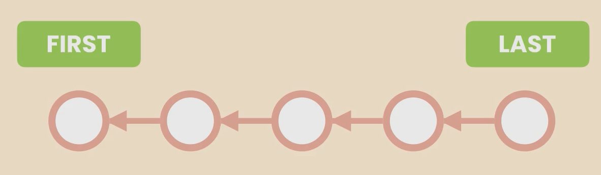

- These commits are part of the **master branch**, the main line of work.

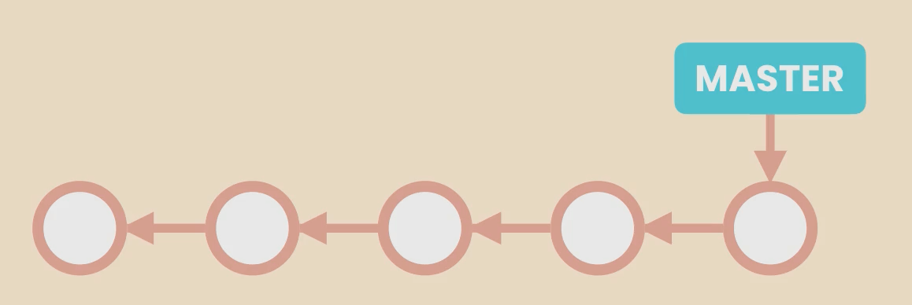

- Git represents branches using a pointer. For example, the **master pointer** points to the latest commit.
- The **HEAD pointer** tells Git which branch you're currently working on.

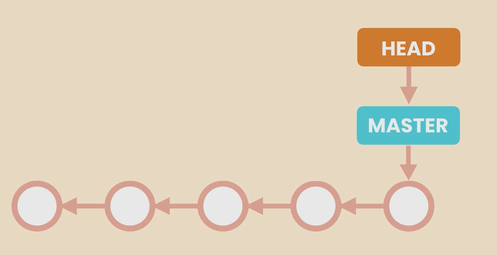

### 🛤️ How HEAD Works
- When you create new commits, both the **master pointer** and **HEAD pointer** move forward.

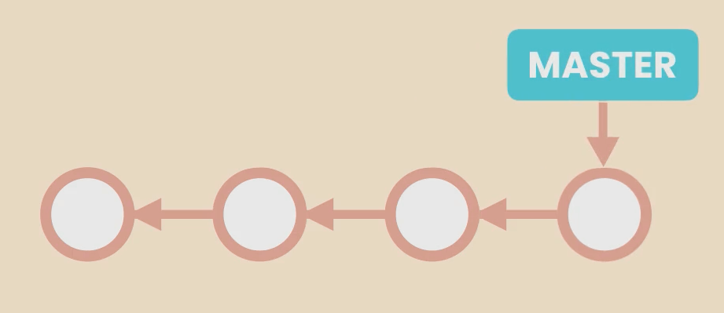

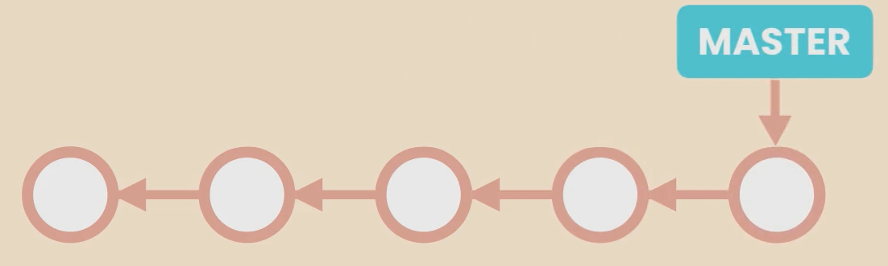

- When you check out a specific commit, the **HEAD pointer** moves to that commit, but it’s no longer attached to any branch. This is called the **detached HEAD state**.

## 🧐 What Happens in Detached HEAD State?
- You can view the code at that point in time.
- ❌ **Do NOT create new commits** because those commits will be **unreachable** and eventually deleted by Git to save space.

### 🛑 Why Shouldn't You Create Commits?
If you create a new commit in the detached HEAD state:
- The commit is not part of any branch.
- It becomes a **dangling commit** and will be deleted by Git during garbage collection.


## 🧐 How to Return to Normal State?
To exit the detached HEAD state and return to the master branch:
```bash
$ git checkout master
```

### 📋 Viewing All Commits (Including Hidden Ones)
```bash
$ git log --oneline --all
```

### 🎯 Visual Representation
```
master ----> commit1 ----> commit2 ----> commit3 ----> commit4 (HEAD)
```

## 🌟 Summary
| Action                        | State                   |
|--------------------------------|---------------------|
| Checkout a commit             | Detached HEAD        |
| Create new commits            | Risk of losing them |
| Return to master branch       | `git checkout master` |
| View all commits              | `git log --oneline --all` |

✅ **Key Takeaway:** Use detached HEAD to explore past code, not to make changes!

## 🛠 Finding Contributions

### 🔍 Checking Individual Contributions

Git provides the `git shortlog` command to summarize contributions made by each author. Here’s an example:

```bash
git shortlog
```

### 📜 Sample Output:
```bash
Sithum-Bimsara (4):
      Create README.md
      Update README.md
      Merge pull request #19 from Sithum-Bimsara/feature/backend/v1
      Merge pull request #21 from Sithum-Bimsara/front-end

Dulitha Perera (3):
      Merge pull request #1 from Sithum-Bimsara/feature/backend/v1
      Add functions to feedback model
      Fix an error and create feedback controller

Sasmitha Uvindu Jayasinghe (3):
      Started creating front end
      Merge pull request #11 from Sithum-Bimsara/feature/backend/v1
      updated the header
```

### 📊 Counting Contributions by Authors

```bash
git shortlog -n -s
```

### 📜 Output:
```bash
   17  Sithum Bimsara
   13  Sasmitha Uvindu Jayasinghe
    8  Dulitha Perera
```

The `-n` option sorts authors by the number of commits, and `-s` shows only the commit count.

---

## 🔄 Restoring a Deleted File

If you accidentally delete a file in Git, you can restore it. Let’s see a real-world scenario:

### 🗑 Deleting a File
```bash
git rm file1.js
```

### 📜 Output:
```bash
rm 'file1.js'
```

### 💾 Committing the Deletion
```bash
git commit -m "Remove file1.js"
```

### 🔍 Finding the Last Commit Containing the File
```bash
git log --oneline -- file1.js
```

### 📜 Output:
```bash
5f28a5d (HEAD -> master) Remove file1.js
4ce9343 All committed
...
```

### ♻ Restoring the File from a Previous Commit
```bash
git checkout 4ce9343 file1.js
```

### ✅ Committing the Restoration
```bash
git commit -m "Restore file1.js"
```

### 🎯 Final Check
```bash
git status
```
```bash
On branch master
nothing to commit, working tree clean
```

---

## 🏷 Finding the Author of a Line (Blame)

The `git blame` command helps identify who made changes to specific lines of a file.

### 🔍 Checking Line-by-Line History
```bash
git blame file1.js
```

### 📜 Output:
```bash
76f9ff77 (Sithum Bimsara 2025-03-17 22:12:03 +0530 1) Hello
76f9ff77 (Sithum Bimsara 2025-03-17 22:12:03 +0530 2) Sithum
76f9ff77 (Sithum Bimsara 2025-03-17 22:12:03 +0530 3) World
```

You can also check with email details:
```bash
git blame -e file1.js
```

### 📜 Output:
```bash
76f9ff77 (<sithim.22@cse.mrt.ac.lk> 2025-03-17 22:12:03 +0530 1) Hello
```

---

## 🏷 Git Tagging

### 🔖 Creating a Lightweight Tag
```bash
git tag v1.0 14f4275
```

### 🔍 Viewing Tags
```bash
git tag
```
```bash
v1.0
```

### 🔍 Viewing Tag Details
```bash
git show v1.0
```

### 🏷 Creating an Annotated Tag
```bash
git tag -a v1.1 -m "My version 1.1"
```

### 📜 Viewing Tags with Messages
```bash
git tag -n
```
```bash
v1.0 Deleted all
v1.1 My version 1.1
```

### 🚀 Checking Out a Tag
```bash
git checkout v1.0
```

### 🗑 Deleting a Tag
```bash
git tag -d v1.1
```

```bash
Deleted tag 'v1.1' (was 464b228)
```

---

This provides a comprehensive understanding of commonly used Git operations, making version control more efficient and reliable. 🚀


# Git Bisect: Finding Bugs Efficiently 🕵️‍♂️🐛

## Introduction
Git bisect is a powerful tool that helps developers quickly find the commit that introduced a bug in their application. Instead of checking out each commit manually, `git bisect` allows us to use a binary search algorithm to pinpoint the faulty commit efficiently.

---

## Commands & Console Output 🖥️

### Checking the Commit History
```sh
git log --oneline
```
**Output:**
```
76f9ff7 (HEAD -> master) Restore file1.js
5f28a5d Remove file1.js
4ce9343 All commited
df9b461 James added to file2
befda4c Bimsara added to file1
16eab60 Hello Sithum World added
14f4275 (tag: v1.0) Deleted all
da3d1b1 2worlds added
2164f63 File 1 changed
6e3f757 File added
```
👉 This command lists all commits in a compact format (one line per commit). The most recent commit appears at the top.

---

### Starting `git bisect`
```sh
git bisect start
```
**Output:**
```
status: waiting for both good and bad commits
```
🔍 This initializes the bisect process, setting up Git to find the commit where the bug was introduced.

---

### Marking the Current Commit as Bad ❌
```sh
git bisect bad
```
**Output:**
```
status: waiting for good commit(s), bad commit known
```
🚨 This tells Git that the current commit has a bug.

---

### Marking an Older Commit as Good ✅
```sh
git bisect good 6e3f757
```
**Output:**
```
Bisecting: 4 revisions left to test after this (roughly 2 steps)
[16eab60108a23d7adb5004fc2d18285db0fa2a70] Hello Sithum World added
```
🕵️‍♂️ This tells Git that the commit `6e3f757` was before the bug appeared, helping it narrow down the search.

---

### Checking the Logs During Bisecting
```sh
git log --oneline
```
**Output:**
```
16eab60 (HEAD) Hello Sithum World added
14f4275 (tag: v1.0) Deleted all
da3d1b1 2worlds added
2164f63 File 1 changed
6e3f757 File added
```
🔍 This shows the current state of commits after the bisect operation.

---

### Narrowing Down Further 🚀
```sh
git bisect good
```
**Output:**
```
Bisecting: 2 revisions left to test after this (roughly 1 step)
[df9b461e3b51bac8cbdbe680fd53f1ef02b44197] James added to file2
```
👉 This tells Git that this commit is still good, further narrowing down the range.

---

### Repeating the Process 🔄
```sh
git bisect good
```
**Output:**
```
Bisecting: 0 revisions left to test after this (roughly 1 step)
[5f28a5d163868c446c64568c2da623796319035f] Remove file1.js
```
🔍 Now only one commit is left to check.

---

### Identifying the First Bad Commit 🚨
```sh
git bisect bad
```
**Output:**
```
Bisecting: 0 revisions left to test after this (roughly 0 steps)
[4ce93435d5eac9900d11105771b863aff982ab84] All commited
```
👉 This confirms that the commit `4ce9343` introduced the bug.

---

### Resetting the Bisect Process 🔄
```sh
git bisect reset
```
**Output:**
```
Previous HEAD position was 4ce9343 All commited
Switched to branch 'master'
```
✅ This restores the repository to its original state before the bisect operation.

---

## Explanation of `git bisect` 🧐

1. **Start the Bisect Process**
   - `git bisect start` initializes the bisect operation.
   
2. **Mark a Bad Commit** ❌
   - `git bisect bad` tells Git the current commit has the bug.
   
3. **Mark a Good Commit** ✅
   - `git bisect good <commit_hash>` tells Git where the bug was not present.
   
4. **Binary Search** 🔍
   - Git will checkout a middle commit.
   - You test if the bug is present.
   - If the bug exists, mark it as `git bisect bad`.
   - If the bug does not exist, mark it as `git bisect good`.
   - Repeat until Git finds the first bad commit.

5. **Identifying the Buggy Commit** 🛠️
   - Git pinpoints the exact commit where the issue was introduced.

6. **Reset to Normal State**
   - `git bisect reset` brings the repository back to normal.

---

## Conclusion 🎯

Using `git bisect`, we efficiently pinpointed the commit where the bug originated, saving time and effort compared to manually checking each commit. This technique is invaluable when debugging large projects.

----
# 📌 Understanding Git Branching

## 🔹 What is Branching?
Branching allows us to diverge from the main line of work and work on something else in isolation. Conceptually, a branch is like a separate workspace.

### 🏗 How Branching Works
- We have a **main workspace** called `master` (or `main`).
- We can create another **workspace (branch)** to work on a new feature separately.
- While developing this new feature, the code might become **unstable**, so we don't want to release it immediately.
- Once development is done, we **test the code**, fix all **bugs**, and then bring the changes back into `master`.
- This process is called **merging**.

### ✅ Why Use Branching?
- Keeps the **main code stable** so it can be released anytime.
- Prevents the main line of work from getting **messed up**.
- Helps new team members start on a **stable code base**.

---

## ⚡ Git Branching vs. Subversion (SVN)
Git handles branches **differently** from other version control systems like Subversion.

### ❌ Subversion (SVN)
- When creating a new branch, **Subversion copies the entire working directory**.
- If a project has **hundreds or thousands of files**, this can take time and waste **disk space**.
- **Slow and inefficient**, leading many developers to dislike branching in SVN.

### ✅ Git Branching (Fast & Lightweight)
- A **branch in Git is just a pointer** to a commit.
- The `master` branch is simply a pointer to the **last commit** in the main line of work.
- As new commits are made, **Git automatically moves this pointer forward**.
- **Creating a branch in Git is almost instant** because it's just a small reference (a **40-byte commit ID**).

---

## 🔀 How Git Handles Branches

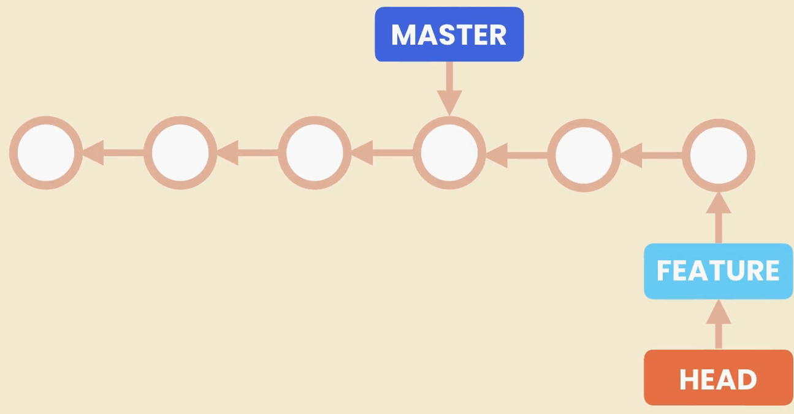


1. **Creating a Branch** 🆕
   - Git creates a new **pointer** that can move around.
   - This pointer is a **tiny file storing the commit ID**.
   
2. **Making New Commits** 📌
   - When we switch to a branch and commit, **Git moves this new pointer forward**.
   - The `master` pointer stays unchanged until we merge the changes.
   
3. **Switching Branches** 🔄
   - When switching back to `master`, Git resets the working directory to the snapshot stored in the latest commit of `master`.
   - Only **one working directory exists** at a time.

4. **Tracking the Current Branch** 📍
   - Git uses a **special pointer** called `HEAD`.
   - `HEAD` is another small file storing the **name of the branch** we're currently working on.
   - When we switch branches, Git updates `HEAD` to point to the target branch.

---

## 🎯 Summary
✅ **Branching keeps the main code stable.**
✅ **Git branches are fast and lightweight.**
✅ **Merging brings changes back to the main branch.**
✅ **HEAD pointer tracks the active branch.**

Throughout this section, you will learn everything needed to work with Git branches efficiently. 🚀

----

## Git Branch Management - Fixing a Bug 🐞

## Introduction 📌
Git is a powerful tool for version control, and managing branches effectively is a crucial skill. In this guide, we will walk through the process of creating, switching, renaming, modifying, and deleting branches while fixing a bug. We will also examine the necessary Git commands and their outputs to ensure a smooth workflow.

---

## Creating a New Branch 🌱
When we receive a bug report, the best practice is to create a new branch to isolate the fix. We do this using:

```bash
$ git branch bugfix
```

### Checking Available Branches 🧐
To list all branches and see the currently active branch:

```bash
$ git branch
```

**Output:**
```
  bugfix
* master
```
The asterisk (*) indicates that we are on the `master` branch.

---

## Switching to the Bugfix Branch 🔄
There are two ways to switch branches:

1️⃣ Old method (deprecated but still works):
```bash
$ git checkout bugfix
```

2️⃣ New recommended method:
```bash
$ git switch bugfix
```

**Output:**
```
Switched to branch 'bugfix'
```

---

## Renaming the Branch ✏️
A generic name like `bugfix` is not very descriptive. It’s better to use something specific:

```bash
$ git branch -m bugfix bugfix/signup-form
```

**Output:**
```
Branch renamed to 'bugfix/signup-form'
```

---

## Making Changes ✍️
Let's open the file `audience.txt` and make some modifications.

```
Who are you?
 
My name is Sithum Bimsara.
I'm 22 years old.
```

to 

```
"Who are you?" 
======================================  
My name is Sithum Wickramanayake
```


After saving the changes, we check the status:

```bash
$ git status
```

**Output:**
```
On branch bugfix/signup-form
Changes not staged for commit:
  (use "git add <file>..." to update what will be committed)
  (use "git restore <file>..." to discard changes in working directory)

	modified:   audience.txt
```

---

## Staging and Committing Changes ✅
To stage the modified file:
```bash
$ git add audience.txt
```

To commit with a message:
```bash
$ git commit -m "Fix bug that prevented users from signing up"
```

**Output:**
```
[bugfix/signup-form 8f19a63] Fix bug that prevented users from signing up
 1 file changed, 3 insertions(+), 1 deletion(-)
```

---

## Checking the Commit Log 📜
To see our commits in a compact format:

```bash
$ git log --oneline
```

**Output:**
```
8f19a63 (HEAD -> bugfix/signup-form) Fix bug that prevented users from signing up
76f9ff7 Restore file1.js
5f28a5d Remove file1.js
```

Notice that `HEAD` is pointing to `bugfix/signup-form`, meaning we are currently on this branch.

---

## Switching Back to Master 🔄
Now, let’s go back to the `master` branch:

```bash
$ git switch master
```

**Output:**
```
Switched to branch 'master'
```

If we open `audience.txt` again, we’ll see the old version because our changes exist only in `bugfix/signup-form`.

---

## Viewing All Branch Commits 🕵️
To see commits across all branches:
```bash
$ git log --oneline --all
```

**Output:**
```
99a39d7 (bugfix/signup-form) Fix the bug in signup
c38d43f (HEAD -> master) Deleted audience.txt
8f19a63 Audience.txt added
76f9ff7 Restore file1.js
5f28a5d Remove file1.js
4ce9343 All commited
df9b461 James added to file2
befda4c Bimsara added to file1
16eab60 Hello Sithum World added
14f4275 (tag: v1.0) Deleted all
da3d1b1 2worlds added
2164f63 File 1 changed
6e3f757 File added
```

---

## Deleting the Bugfix Branch 🗑️
Once we merge the `bugfix/signup-form` branch into `master`, we no longer need it.

Attempting to delete it normally:
```bash
$ git branch -d bugfix/signup-form
```
**Output (error message if branch is not merged yet):**
```
error: The branch 'bugfix/signup-form' is not fully merged.
```

To force delete it:
```bash
$ git branch -D bugfix/signup-form
```

**Output:**
```
Deleted branch bugfix/signup-form (was 76f9ff7).
```

---

## Conclusion 🎯
In this guide, we learned how to:
✅ Create and switch branches
✅ Rename branches for better clarity
✅ Make changes and commit them
✅ View commit logs
✅ Delete branches safely

This workflow helps us maintain a clean and organized Git history while preventing accidental commits to the wrong branch. 🚀

---
# 📌 Comparing Branches in Git

## 🧐 Introduction
When working with Git, it's crucial to compare branches before merging them into the main branch (e.g., `master`). In this guide, we’ll explore various ways to check how a branch differs from `master` using Git commands. 

---

## 🔍 Checking Commits in a Branch
Before merging a branch, we need to identify the commits that exist in the feature or bugfix branch but not in `master`. We use the following command:

```bash
$ git log master..bugfix/signup-form
```

### 📝 Output:
```bash
commit fc89881a9248f431c31e97ed56e8091db8b99e3f (bugfix/signup-form)
Author: Sithum Bimsara <sithim.22@cse.mrt.ac.lk>
Date:   Sun Mar 23 02:06:47 2025 +0530

    Changed audience.txt from bugfix/signup-form branch
```

### 🔎 Explanation:
- This command lists all the commits in `bugfix/signup-form` that are **not** in `master`.
- In this case, there is **one commit**, but if there were more, all of them would be listed.
- The `master..bugfix/signup-form` syntax means: "Show me all commits in `bugfix/signup-form` that `master` doesn’t have."

👉 If you want a more concise output, you can use:
```bash
$ git log --oneline master..bugfix/signup-form
```

---

## 🛠 Viewing Code Changes
If we want to see the actual file changes instead of just commit messages, we use:

```bash
$ git diff master..bugfix/signup-form
```

### 📝 Output:
```diff
diff --git a/audience.txt b/audience.txt
index a9fd72c..1e80bad 100644
--- a/audience.txt
+++ b/audience.txt
@@ -1,7 +1,7 @@
 Who are you?
+==========================
+My name is Sithum Wickramanayake

-My name is Sithum Bimsara
-I'm 22 years old
```

### 🔎 Explanation:
- The `+` lines indicate new additions.
- The `-` lines indicate removals.
- This tells us that the `audience.txt` file has been modified: 
  - The old name "Sithum Bimsara" was changed to "Sithum Wickramanayake".
  - "I'm 22 years old" was removed.
  
👉 If we are currently on `master`, we can simplify the command:
```bash
$ git diff bugfix/signup-form
```

---

## 📂 Checking Affected Files
Sometimes, we don’t need to see the detailed changes, just the **list of modified files**. We use:

```bash
$ git diff --name-status bugfix/signup-form
```

### 📝 Output:
```bash
M       audience.txt
```

### 🔎 Explanation:
- The `M` means the file **audience.txt** has been modified.
- This helps quickly identify which files will be changed when merging the branch.

---

## 🎯 Summary
| Command | Purpose |
|---------|---------|
| `git log master..branch` | Shows commits in `branch` but not in `master` |
| `git log --oneline master..branch` | Shows commits in a compact format |
| `git diff master..branch` | Shows line-by-line changes between `master` and `branch` |
| `git diff branch` | Shorter version if on `master` |
| `git diff --name-status branch` | Lists only the changed files |

By using these commands, you can effectively review the changes in a branch before merging it into `master`. 🚀

---

# Git Stash Operations Explained 🚀

## Introduction 📌
When working with Git, sometimes we have local changes that we haven't committed yet, but we need to switch branches. Git prevents switching in such cases to avoid losing changes. In this guide, we will explore how to use Git Stash to temporarily save changes and retrieve them later.

---

## Checking Branches 🌿
To check which branches exist and which one we are currently on, we use:

```bash
$ git branch
```

**Output:**
```
  bugfix/signup-form
* master
```

Here, `master` is the active branch (`*` indicates the current branch).

---

## Error When Switching Branches 🚨
If we try to switch branches without committing or stashing local changes, we get an error:

```bash
$ git switch bugfix/signup-form
```

**Error Output:**
```
error: Your local changes to the following files would be overwritten by checkout:
        audience.txt
Please commit your changes or stash them before you switch branches.
Aborting
```

Since we don’t want to commit the changes yet, we will **stash** them.

---

## Stashing Changes 🗂️
To temporarily save changes, use the `git stash push` command:

```bash
$ git stash push -m "New tax rules"
```

**Output:**
```
Saved working directory and index state On master: New tax rules
```

---

## Handling Untracked Files 📂
By default, untracked files are not included in the stash. Let's create a new file:

```bash
$ echo hello > newfile.txt
```

Check the status:

```bash
$ git status -s
```

**Output:**
```
?? newfile.txt
```

To stash all files, including untracked ones:

```bash
$ git stash push -am "My new stash"
```

**Output:**
```
Saved working directory and index state On master: My new stash
```

---

## Listing Stashed Changes 📜
To view stored stashes:

```bash
$ git stash list
```

**Output:**
```
stash@{0}: On master: My new stash
stash@{1}: On master: New tax rules
```

---

## Switching Branches 🔄
Now we can switch to another branch without losing changes:

```bash
$ git switch bugfix/signup-form
```

**Output:**
```
Switched to branch 'bugfix/signup-form'
```

We can switch back to `master` anytime:

```bash
$ git switch master
```

**Output:**
```
Switched to branch 'master'
```

---

## Viewing Stashed Changes 👀
Before applying a stash, check its contents:

```bash
$ git stash show stash@{1}
```

**Output:**
```
audience.txt | 2 +-
1 file changed, 1 insertion(+), 1 deletion(-)
```

The same output can be obtained using:

```bash
$ git stash show 1
```

---

## Applying a Stash 🛠️
To apply a specific stash to the working directory:

```bash
$ git stash apply 1
```

**Output:**
```
On branch master
Changes not staged for commit:
  (use "git add <file>..." to update what will be committed)
  (use "git restore <file>..." to discard changes in working directory)
        modified:   audience.txt
```

---

## Removing a Stash 🗑️
Once a stash is applied, we can delete it:

```bash
$ git stash drop 1
```

**Output:**
```
Dropped refs/stash@{1} (f92bb35ab1d8197db347e9fb3a47aee0b8221e3e)
```

To verify:

```bash
$ git stash list
```

**Output:**
```
stash@{0}: On master: My new stash
```

---

## Clearing All Stashes 🧹
To remove all stashes at once:

```bash
$ git stash clear
```

After this, running `git stash list` will return nothing.

---

## Conclusion 🎯
Git Stash is a powerful tool that allows you to temporarily store changes and retrieve them later without committing. It helps in switching branches safely without losing work. Now you can confidently stash, apply, drop, and clear stashes in your projects! 🚀

---

# 🛠️ Understanding Git Merging: Fast Forward & Three-Way Merges

Merging is the process of integrating changes from one branch into another. In Git, we have two types of merges:

1. **Fast Forward Merges** 🚀
2. **Three-Way Merges** 🔀

Let's explore both with real-world examples! 🧐

---

## 🔹 Fast Forward Merge


### Scenario 📝
Imagine we have a master branch with three commits. We create a new branch called `bugfix`. In Git, a branch is just a pointer to a commit. Initially, both `master` and `bugfix` point to the same commit.

```sh
# Check the current branches
$ git branch
* master

# Create and switch to a new branch
$ git checkout -b bugfix
Switched to a new branch 'bugfix'
```

Now, we make a couple of commits on the `bugfix` branch.

```sh
# Make changes and commit
$ echo "Fixing a bug" > bug.txt
$ git add bug.txt
$ git commit -m "Fixed a bug"

# Make another change
$ echo "Another fix" >> bug.txt
$ git commit -am "Another fix applied"
```


At this point, the `bugfix` branch is ahead of `master`. Since the branches haven't diverged, merging is straightforward.

```sh
# Switch back to master
$ git checkout master

# Merge the bugfix branch
$ git merge bugfix
```

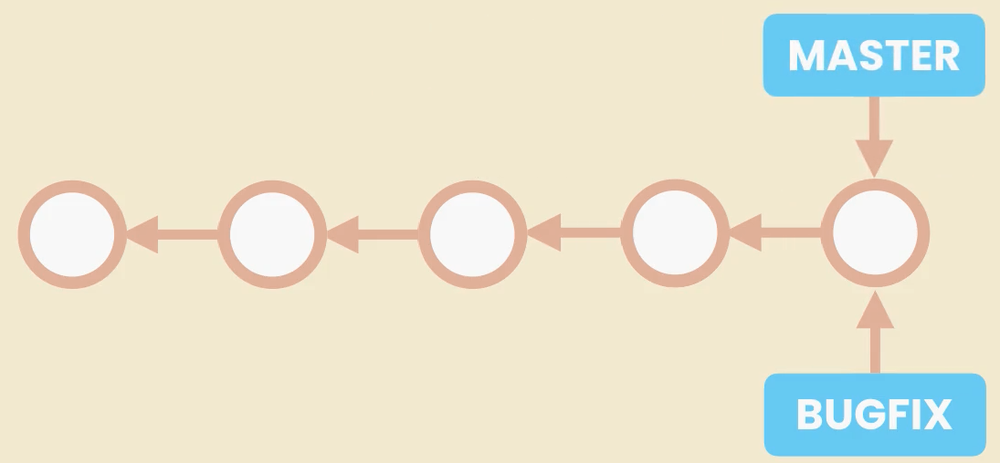


🔹 **What happens?**
Since there’s a direct linear path from `bugfix` to `master`, Git **moves the `master` pointer forward** without creating a new commit. This is a **Fast Forward Merge**.

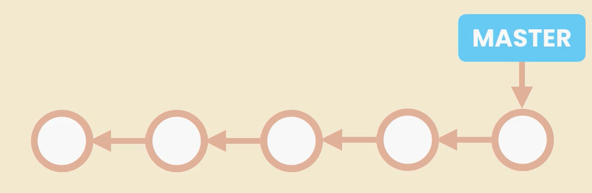

```sh
Updating 3f7a6c2..9b9cbb1
Fast-forward
 bug.txt | 2 ++
 1 file changed, 2 insertions(+)
```

Once merged, we can delete the `bugfix` branch.

```sh
$ git branch -d bugfix
Deleted branch bugfix.
```

✅ **Fast Forward Merge is simple and efficient because no extra commits are created.**

---

## 🔹 Three-Way Merge

### Scenario 📝
Now, let’s explore a case where branches have **diverged**.

```sh
# Create a new branch and switch to it
$ git checkout -b bugfix
```

Make some changes in the `bugfix` branch.

```sh
$ echo "Bug fixed" > bug.txt
$ git add bug.txt
$ git commit -m "Bug fix implemented"
```

Now, **before merging**, we switch to `master` and make another change.

```sh
# Switch to master
$ git checkout master

# Modify another file
$ echo "Feature update" > feature.txt
$ git add feature.txt
$ git commit -m "Feature update added"
```

At this point, `master` and `bugfix` have **different changes**. If we try to merge, Git **cannot fast forward** because `master` has unique commits.

```sh
# Merge the bugfix branch into master
$ git merge bugfix
```

🔹 **What happens?**
Since `master` and `bugfix` have diverged, Git creates a **new commit** that combines changes from both branches. This is a **Three-Way Merge**.


```sh
Merge made by the 'recursive' strategy.
 bug.txt     | 1 +
 feature.txt | 1 +
 2 files changed, 2 insertions(+)
```

Git automatically resolves the changes and generates a **merge commit**.

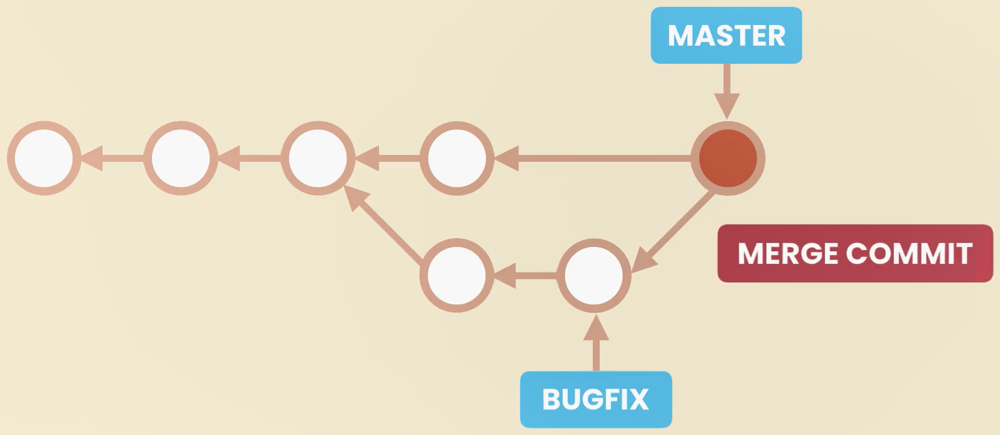

📌 **Why is it called a Three-Way Merge?**
It involves three commits:
1. The common ancestor (original commit before branching)
2. The `master` branch tip
3. The `bugfix` branch tip

Git looks at these three snapshots and decides how to combine them.

✅ **Three-Way Merge ensures that both branches' changes are preserved.**

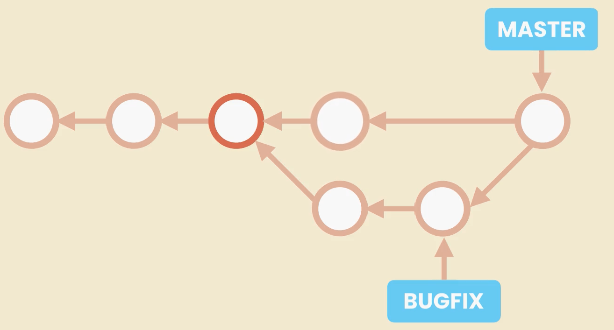
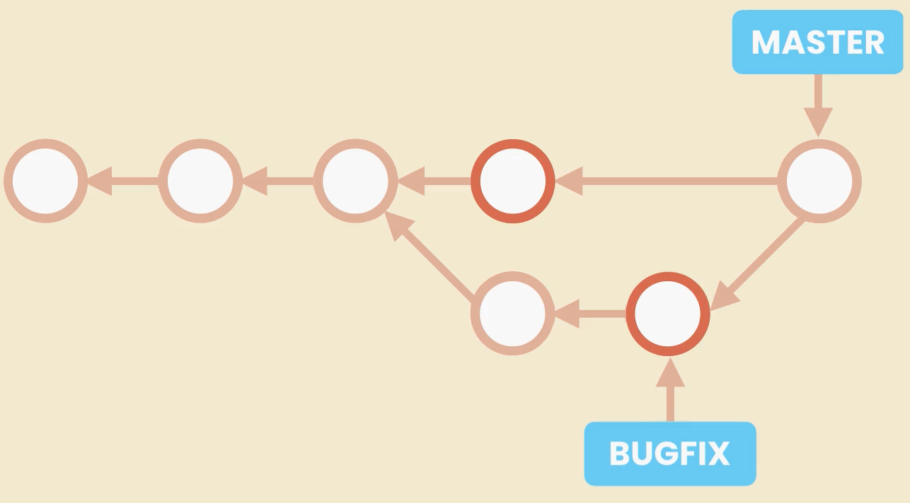

---

## 🔹 Recap 🏆
- **Fast Forward Merge** happens when branches haven't diverged. Git simply moves the pointer forward.
- **Three-Way Merge** happens when branches have diverged. Git creates a new commit to merge changes.

🎯 **Understanding when to use each type of merge is crucial for maintaining a clean Git history!**

---

# 📒 Git Notebook: Fast Forward & No Fast Forward Merges

## 📌 Introduction
This notebook covers the concepts of **Fast Forward (FF) Merges** and **No Fast Forward (No-FF) Merges** in Git. We will explore how these merge strategies work, their advantages and disadvantages, and how to configure them.

---

## 📌 Checking the Git Log with Graph Representation

Before performing any merge operation, it's good practice to check the log with a graphical representation to see how branches diverge.

```sh
git log --oneline --all --graph
```

### 📌 Output:
```
* f76e273 (HEAD -> bugfix/signup-form) Fix the bug that protects users from signing up
* 8797d0e (master) TOC.txt added
* a2410e0 Audience.txt added
* 68a073e File2 added
* c43539f File1 added
```
🔍 **Observation:** The `bugfix/signup-form` branch is ahead of `master` by one commit.

---

## 📌 Performing a Fast Forward Merge

Since `master` has not diverged from `bugfix/signup-form`, we can merge using a **Fast Forward Merge**.

### **1️⃣ Switch to the `master` branch**
```sh
git switch master
```
**Output:**
```
Switched to branch 'master'
```

### **2️⃣ Merge `bugfix/signup-form` into `master`**
```sh
git merge bugfix/signup-form
```
**Output:**
```
Updating 8797d0e..f76e273
Fast-forward
 toc.txt | 1 +
 1 file changed, 1 insertion(+)
```
✅ **Fast Forward Merge Complete**: The `master` branch now points to `f76e273`, creating a linear history.

---

## 📌 Creating and Merging with No Fast Forward
To disable Fast Forward merging and retain a merge commit, use `--no-ff`.

### **1️⃣ Create and switch to a new branch**
```sh
git switch -C bugfix/login-form
```
**Output:**
```
Switched to a new branch 'bugfix/login-form'
```

### **2️⃣ Modify `toc.txt`, stage, and commit the changes**
```sh
code toc.txt
git add toc.txt
git commit -m "Update toc.txt"
```
**Output:**
```
[bugfix/login-form 8538e99] Update toc.txt
 1 file changed, 1 insertion(+), 1 deletion(-)
```

### **3️⃣ Switch back to `master` and attempt a No Fast Forward Merge**
```sh
git switch master
git merge --no-ff bugfix/login-form
```
**Output:**
```
Merge made by the 'ort' strategy.
 toc.txt | 2 +-
 1 file changed, 1 insertion(+), 1 deletion(-)
```

### 📌 Checking the log again
```sh
git log --oneline --all --graph
```
**Output:**
```
*   ff8fcb1 (HEAD -> master) Merge branch 'bugfix/login-form'
|\
| * 8538e99 (bugfix/login-form) Update toc.txt
|/
* f76e273 (bugfix/signup-form) Fix the bug that protects users from signing up
* 8797d0e TOC.txt added
* a2410e0 Audience.txt added
* 68a073e File2 added
* c43539f File1 added
```
🔍 **Observation:**
- A **merge commit (`ff8fcb1`)** is created.
- The branch history is **not linear** due to the explicit merge commit.

---

## 📌 Fast Forward vs No Fast Forward: Which One to Use?

| Merge Type       | Pros ✅ | Cons ❌ |
|------------------|--------|---------|
| **Fast Forward** | Keeps history linear 📜 | History may not reflect actual merging ⏳ |
| **No Fast Forward** | Creates an explicit merge commit 📌 | More commits in history 📂 |

🚀 **Key Takeaway:**
- If you want a **cleaner** linear history, use **Fast Forward**.
- If you want to **track merges explicitly**, use **No Fast Forward**.

---

## 📌 Setting No Fast Forward as Default

To ensure all merges require an explicit commit:
```sh
git config --global merge.ff no
```
🔧 **This applies to all repositories globally.**

---

## 📌 Conclusion
- A **Fast Forward Merge** keeps a **linear** history when branches haven't diverged.
- A **No Fast Forward Merge** creates a **merge commit**, making it easier to track changes.
- Git allows configuring `merge.ff no` to enforce No Fast Forward merges.

🎯 **Choose the strategy that best fits your team's workflow!**

---

# 📖 Git Three-Way Merge: A Complete Walkthrough

## 🎯 Introduction
In this lesson, we'll explore the concept of a **three-way merge** in Git. This is useful when two branches have diverged, meaning they have independent changes that need to be merged back together.

---

## 🚀 Step-by-Step Process

### 🔍 Step 1: Checking Our Current Git History
First, let's check our Git history to see where we are:
```sh
$ git log --oneline --all --graph
```
🔹 **Output:**
```
*   ff8fcb1 (HEAD -> master) Merge branch 'bugfix/login-form'
|\
| * 8538e99 (bugfix/login-form) Update toc.txt
|/
* f76e273 (bugfix/signup-form) Fix the bug that protect user from sign up
* 8797d0e TOC.txt added
* a2410e0 Audience.txt added
* 68a073e File2 added
* c43539f File1 added
```

---

### 🔥 Step 2: Creating a New Feature Branch
Let's create a new branch for implementing a **Change Password** feature:
```sh
$ git switch -C feature/change-password
```
🔹 **Output:**
```
Switched to a new branch 'feature/change-password'
```

Now, let's check our history again:
```sh
$ git log --oneline --all --graph
```
🔹 **Output:**
```
*   ff8fcb1 (HEAD -> feature/change-password, master) Merge branch 'bugfix/login-form'
|\
| * 8538e99 (bugfix/login-form) Update toc.txt
|/
* f76e273 (bugfix/signup-form) Fix the bug that protect user from sign up
* 8797d0e TOC.txt added
* a2410e0 Audience.txt added
* 68a073e File2 added
* c43539f File1 added
```
Both **master** and **feature/change-password** are pointing to the same commit.

---

### ✍ Step 3: Making Changes in the Feature Branch
Let's add a new file related to the **Change Password** feature:
```sh
$ echo hello > change-password.txt
$ git add .
$ git commit -m "Build the change password form"
```
🔹 **Output:**
```
[feature/change-password 6ca05c1] Build the change password form
 1 file changed, 1 insertion(+)
 create mode 100644 change-password.txt
```

Checking the history again:
```sh
$ git log --oneline --all --graph
```
🔹 **Output:**
```
* 6ca05c1 (HEAD -> feature/change-password) Build the change password form
*   ff8fcb1 (master) Merge branch 'bugfix/login-form'
|\
| * 8538e99 (bugfix/login-form) Update toc.txt
|/
* f76e273 (bugfix/signup-form) Fix the bug that protect user from sign up
```

---

### 🔁 Step 4: Making Changes in Master Branch
Now, let's switch back to **master** and modify a file:
```sh
$ git switch master
$ git add toc.txt
$ git commit -m "Update TOC.txt"
```
🔹 **Output:**
```
[master 80a74e4] Update TOC.txt
 1 file changed, 1 insertion(+), 1 deletion(-)
```

Checking the log:
```sh
$ git log --oneline --all --graph
```
🔹 **Output:**
```
* 80a74e4 (HEAD -> master) Update TOC.txt
| * 6ca05c1 (feature/change-password) Build the change password form
|/
*   ff8fcb1 Merge branch 'bugfix/login-form'
|\
| * 8538e99 (bugfix/login-form) Update toc.txt
|/
* f76e273 (bugfix/signup-form) Fix the bug that protect user from sign up
```

Now, the **feature/change-password** and **master** branches have diverged.

---

### 🔗 Step 5: Performing a Three-Way Merge
Since both branches have independent changes, let's merge them:
```sh
$ git merge feature/change-password
```
🔹 **Output:**
```
Merge made by the 'ort' strategy.
 change-password.txt | 1 +
 1 file changed, 1 insertion(+)
 create mode 100644 change-password.txt
```

Checking the final log:
```sh
$ git log --oneline --all --graph
```
🔹 **Output:**
```
*   e090bc9 (HEAD -> master) Merge branch 'feature/change-password'
|\
| * 6ca05c1 (feature/change-password) Build the change password form
* | 80a74e4 Update TOC.txt
|/
*   ff8fcb1 Merge branch 'bugfix/login-form'
```

---

## 🎯 Conclusion
✔️ We successfully created a **feature branch**, made changes to it, modified the **master** branch separately, and performed a **three-way merge**.

💡 **Key Takeaways:**
- A **three-way merge** occurs when two branches have diverged.
- Git compares the latest commits on both branches with their **common ancestor**.
- The merge process creates a new **merge commit** that combines changes from both branches.

🚀 Now you have a solid understanding of how to handle a **three-way merge** in Git! 🎉

---


# 📌 Managing Merged and Unmerged Branches in Git

## 🛠️ Merging and Deleting Branches

When we finish working on a branch, the best practice is to merge it into the `master` (or `main`) branch and then delete it. However, sometimes we forget to delete a merged branch. Over time, these branches pile up, leading to confusion about whether they are already merged or not. 

Let's go through how to check for merged and unmerged branches. 

---

## 📋 Viewing Merged Branches

Currently, we are on the `master` branch. To see the list of branches that have been merged into the current branch (`master`), use the following command:

```sh
git branch --merged
```

This will display all the branches that have already been merged into `master`. Since these branches have been merged, it's safe to delete them if you're done working on them.

🚀 **Best practice:** Delete merged branches to keep your repository clean and organized!

To delete a merged branch, use:

```sh
git branch -d bugfix/login
```

🔹 This will remove the `bugfix/login` branch since it's already merged.

---

## ❌ Viewing Unmerged Branches

To check for branches that have **not** been merged into the current branch, use:

```sh
git branch --no-merged
```

If no output appears, it means that all branches have already been merged. If there are branches listed, it means they are still unmerged and may contain important work.

---

## 🎯 Summary

✅ **Use `git branch --merged`** to list merged branches.

✅ **Use `git branch --no-merged`** to list unmerged branches.

✅ **Delete merged branches using `git branch -d <branch-name>`** to keep your repo clean.

By following these steps, you can efficiently manage branches in Git and avoid unnecessary clutter in your repository. 🚀✨

----

# 📒 Git Branching & Merging: Handling Conflicts

## 🚀 Introduction
When working with Git, merging branches is a common task. However, merge conflicts often arise when changes overlap. This guide demonstrates handling merge conflicts through a practical example.

---

## 📌 Checking Available Branches
```bash
git branch
```
**Output:**
```
  bugfix/login-form
  bugfix/signup-form
  feature/change-password
* master
```
📌 The asterisk (*) indicates the active branch (`master`).

---

## 🔄 Creating and Switching to a New Branch
```bash
git switch -C bugfix/change-password
```
**Output:**
```
Switched to a new branch 'bugfix/change-password'
```
📌 This command creates (`-C`) and switches to the `bugfix/change-password` branch.

---

## 📝 Editing a File
```bash
code change-password.txt
```
📌 Opens `change-password.txt` in VS Code for editing.

---

## 📤 Staging and Committing Changes
```bash
git add .
git commit -m"Update change-password.txt"
```
**Output:**
```
[bugfix/change-password 397f30f] Update change-password.txt
 1 file changed, 1 insertion(+)
```
📌 Stages all changes (`git add .`) and commits them with a message.

---

## 🔍 Viewing Commit History
```bash
git log --oneline --all --graph
```
**Output (Simplified):**
```
* 397f30f (HEAD -> bugfix/change-password) Update change-password.txt
*   e090bc9 (master) Merge branch 'feature/change-password'
* | 80a74e4 Update TOC.txt
```
📌 Displays a graphical representation of commit history.

---

## 🔄 Switching Back to Master Branch
```bash
git switch master
```
**Output:**
```
Switched to branch 'master'
```
📌 Moves back to the `master` branch.

---

## 🔗 Merging Changes and Encountering a Conflict
```bash
git merge bugfix/change-password
```
**Output:**
```
Auto-merging change-password.txt
CONFLICT (content): Merge conflict in change-password.txt
Automatic merge failed; fix conflicts and then commit the result.
```
📌 A merge conflict occurs because `change-password.txt` has different changes in both branches.

---

## 🔍 Checking Status of Merge Conflict
```bash
git status
```
**Output:**
```
On branch master
You have unmerged paths.
  (fix conflicts and run "git commit")
Unmerged paths:
  both modified:   change-password.txt
```
📌 Git indicates that `change-password.txt` has conflicts.

---

## ✏️ Resolving the Conflict
### 🔹 Opening the File
```bash
code change-password.txt
```
📌 Opens the file in VS Code to manually resolve conflicts.

### 🔹 Understanding Merge Conflict Markers
```
<<<<<<< HEAD
Change in the master branch
=======
Change in the bugfix branch
>>>>>>> bugfix/change-password
```


📌 Git marks conflicts with:
- **`<<<<<<< HEAD`**: Changes in the current branch (`master`)
- **`=======`**: Divider
- **`>>>>>>>`**: Changes in the other branch (`bugfix/change-password`)

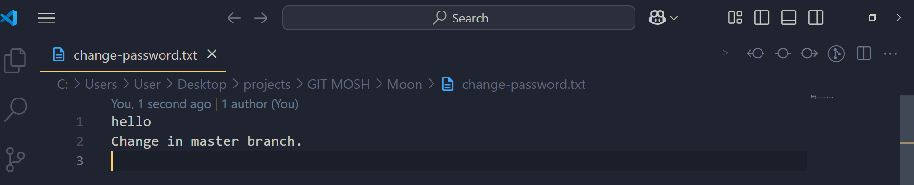
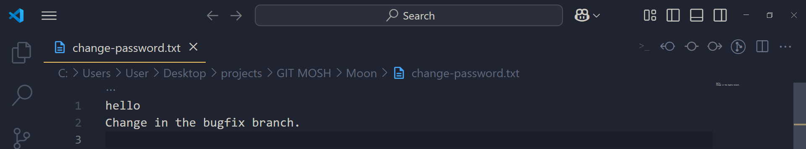


### 🔹 Resolving by Keeping Both Changes
```txt
Change in the master branch
Change in the bugfix branch
```
📌 Manually remove conflict markers and keep both changes.

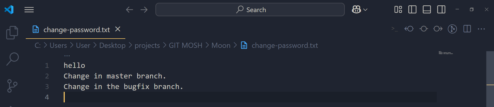

---

## 📤 Staging and Completing the Merge
```bash
git add change-password.txt
git commit
```
**Output:**
```
[master 5c03854] Merge branch 'bugfix/change-password'
```
📌 The merge is now successfully completed! 🎉

---

## 🎯 Key Takeaways
- Merge conflicts happen when the same file is modified differently in two branches.
- Git marks conflicts with `<<<<<<<`, `=======`, and `>>>>>>>`.
- Resolve conflicts manually, stage changes, and commit.
- Avoid introducing new code while resolving conflicts unless necessary.

---

# 📌 Handling Merge Conflicts and Aborting a Merge in Git

## 🧐 What Happens When You Encounter Merge Conflicts?
When merging branches in Git, you might face **merge conflicts**. This happens when Git is unable to automatically reconcile differences between the branches. In such cases, Git requires you to manually resolve the conflicts before proceeding with the merge.

## 🤔 What If You're Not Ready to Resolve the Conflicts?
Sometimes, you may not have time to resolve conflicts immediately, or you may be in the middle of another task. In such situations, Git provides a way to **abort the merge** and return to the previous state.

## 🚀 How to Abort a Merge
To **abort an ongoing merge**, use the following command:

```bash
$ git merge --abort
```

### 📝 Explanation:
- This command cancels the merge process.
- It resets your working directory to the state before the merge started.
- If you have already resolved some conflicts and staged the changes, those changes will be discarded.
- Your repository will return to a clean state as if the merge never happened.

## 🛠 Example Scenario
### Step 1: Create a New Repository and Initialize Git
```bash
$ mkdir merge-example
$ cd merge-example
$ git init
```
**Output:**
```
Initialized empty Git repository in /path/to/merge-example/.git/
```

### Step 2: Create and Switch to a New Branch
```bash
$ git checkout -b feature-branch
```
**Output:**
```
Switched to a new branch 'feature-branch'
```

### Step 3: Create a File and Make Changes in Different Branches
#### On `feature-branch`
```bash
echo "Hello from feature branch!" > file.txt
git add file.txt
git commit -m "Added file.txt in feature branch"
```
**Output:**
```
[feature-branch (root-commit) 123abc] Added file.txt in feature branch
 1 file changed, 1 insertion(+)
 create mode 100644 file.txt
```

#### Switch to `main` and Modify the Same File
```bash
$ git checkout main
echo "Hello from main branch!" > file.txt
git add file.txt
git commit -m "Modified file.txt in main branch"
```
**Output:**
```
[main 456def] Modified file.txt in main branch
 1 file changed, 1 insertion(+), 1 deletion(-)
```

### Step 4: Try to Merge `feature-branch` into `main`
```bash
$ git merge feature-branch
```
**Output (Merge Conflict Detected):**
```
Auto-merging file.txt
CONFLICT (content): Merge conflict in file.txt
Automatic merge failed; fix conflicts and then commit the result.
```

### Step 5: Abort the Merge
If you're not ready to resolve the conflict, use:
```bash
$ git merge --abort
```
**Output:** (No explicit output, but the merge is aborted)

### Step 6: Verify the Merge Abort
```bash
$ git status
```
**Output:**
```
On branch main
nothing to commit, working tree clean
```

## ✅ Summary
- **Encountered a merge conflict?** Git will notify you about it.
- **Not ready to resolve?** Use `git merge --abort` to go back to the previous clean state.
- **No changes will be saved** from the merge attempt if you abort it.

This technique is very useful when dealing with complex conflicts and needing to step back before making final decisions. 🛠️🔥

---


# 📖 Git Merge, Reset, and Revert: A Complete Guide

## 🔍 Understanding Merge Commits
A **merge commit** is created when Git combines two branches together. However, sometimes after merging, we realize that the merge introduced issues, such as compilation errors or logical conflicts in our application. In such cases, we need to **undo the merge**.

There are **two main ways** to undo a merge:
1. **Resetting the commit** (if the merge is local and has not been pushed to the remote repository)
2. **Reverting the commit** (if the merge has already been pushed)

---

## 📌 Viewing Git History
Before making any changes, let's inspect the Git commit history using:

```sh
$ git log --oneline --all --graph
```

### ✅ Output:
```
*   5c03854 (HEAD -> master) Merge branch 'bugfix/change-password'
|\
| * 397f30f (bugfix/change-password) Update change-password.txt
* | 8de2d9a Update change-password.txt
|/
*   e090bc9 Merge branch 'feature/change-password'
|\
| * 6ca05c1 (feature/change-password) Build the change password form
* | 80a74e4 Update TOC.txt
|/
```
🔹 The topmost commit **5c03854** is a merge commit.
🔹 This merge combined the `bugfix/change-password` branch into `master`.

---

## 🛑 Undoing a Merge Using `git reset`
If the merge was local and has **not been pushed**, we can remove it completely using:

```sh
$ git reset --hard HEAD~1
```

### ✅ Output:
```
HEAD is now at 8de2d9a Update change-password.txt
```
This moves `HEAD` **one commit back**, effectively removing the merge.

📌 **Note:** `--hard` option resets both the working directory and index.

🔹 Let's check the history again:

```sh
$ git log --oneline --all --graph
```

### ✅ Output:
```
* 8de2d9a (HEAD -> master) Update change-password.txt
| * 397f30f (bugfix/change-password) Update change-password.txt
|/
*   e090bc9 Merge branch 'feature/change-password'
```
The merge commit **is no longer in the history!**

---

## 🔄 Recovering a Reset Merge
If you mistakenly reset a merge, you can **restore it** using the commit hash:

```sh
$ git reset --hard 5c03854
```

### ✅ Output:
```
HEAD is now at 5c03854 Merge branch 'bugfix/change-password'
```
Now the merge is back! 🎉

---

## 🔄 Undoing a Merge Using `git revert`
If the merge **has been pushed** to a remote repository, we should not use `reset`. Instead, we **revert the merge** to create a new commit that cancels the merge changes.

Let's try to revert the last merge commit:

```sh
$ git revert HEAD
```

### ❌ Error Output:
```
error: commit 5c03854 is a merge but no -m option was given.
fatal: revert failed
```

📌 **Why did this fail?**
A merge commit has **two parents**, and Git needs to know which parent to keep.

✅ To revert the merge while keeping the changes from `master`, we use:

```sh
$ git revert -m 1 HEAD
```

### ✅ Output:
```
[master 6e0b0dd] Revert "Merge branch 'bugfix/change-password'"
 1 file changed, 1 insertion(+), 1 deletion(-)
```

🔹 `-m 1` tells Git to keep the **first parent** (master branch) while undoing the merge.

🔹 Let's verify the new history:

```sh
$ git log --oneline --all --graph
```

### ✅ Output:
```
* 6e0b0dd (HEAD -> master) Revert "Merge branch 'bugfix/change-password'"
*   5c03854 Merge branch 'bugfix/change-password'
|\
| * 397f30f (bugfix/change-password) Update change-password.txt
* | 8de2d9a Update change-password.txt
|/
```
A **new commit (6e0b0dd)** has been added to undo the merge!

---

## Understanding `git reset` Options


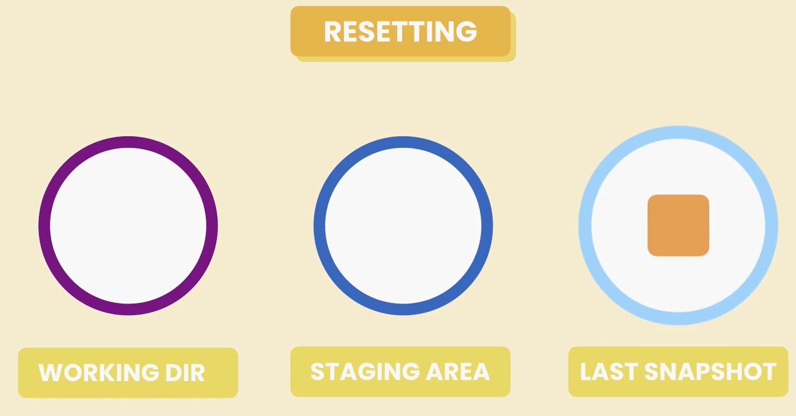


When we use `git reset`, we can specify different options to control what gets updated. These options determine how Git manipulates the HEAD, staging area, and working directory.

### 1. `git reset --soft <commit>`
- The HEAD pointer moves to the specified commit.
- The staging area (index) remains unchanged.
- The working directory remains unchanged.
- Example:
  ```sh
  git reset --soft HEAD~1
  ```
  This moves HEAD back by one commit but keeps the changes staged.

### 2. `git reset --mixed <commit>` (default)
- The HEAD pointer moves to the specified commit.
- The staging area is updated to match the new HEAD.
- The working directory remains unchanged.
- Example:
  ```sh
  git reset --mixed HEAD~1
  ```
  This resets the last commit and unstages the changes, but they remain in the working directory.

### 3. `git reset --hard <commit>`
- The HEAD pointer moves to the specified commit.
- The staging area is updated to match the new HEAD.
- The working directory is also updated, discarding any changes.
- Example:
  ```sh
  git reset --hard HEAD~1
  ```
  This removes the last commit and any local changes permanently.

### Summary Table
| Option | HEAD Moves | Staging Area Updates | Working Directory Updates |
|--------|------------|----------------------|-------------------------|
| `--soft` | ✅ | ❌ | ❌ |
| `--mixed` | ✅ | ✅ | ❌ |
| `--hard` | ✅ | ✅ | ✅ |

Be careful when using `--hard` as it will remove any uncommitted changes permanently!

---

## 📝 Summary
| Command | Action |
|---------|--------|
| `git log --oneline --all --graph` | View commit history |
| `git reset --hard HEAD~1` | Remove last commit (use only if not pushed) |
| `git reset --hard <commit-hash>` | Restore a removed commit |
| `git revert HEAD` | Undo last commit (fails for merge commits) |
| `git revert -m 1 HEAD` | Revert a merge commit and keep first parent |

🚀 **Best Practice:** Use `reset` only for local changes. If the merge has been pushed, always use `revert`!

---

💡 **Now you know how to safely undo a Git merge!** 🎉

---


# 📖 Git Squash Merging Explained with Example

## 🚀 Introduction
Squash merging is a powerful technique in Git that allows us to combine multiple commits into a single commit before merging into the main branch. This helps keep the commit history clean and avoids unnecessary, low-quality commits from cluttering the master branch.

---

## 🛠 Step-by-Step Guide to Squash Merging

### 1️⃣ Create a New Branch
```bash
git switch -C bugfix/photo-upload
```
👉 **Explanation:** 
- `git switch -C bugfix/photo-upload` creates a new branch called `bugfix/photo-upload` and switches to it.
- `-C` ensures that the branch is created if it doesn't exist.

---

### 2️⃣ Make Changes and Commit
#### 🔹 First Commit
```bash
echo bugfix >> audience.txt
git commit -am "Update audience.txt"
```
**Git Output:**
```
[bugfix/photo-upload afa2081] Update audience.txt
 1 file changed, 1 insertion(+)
```
👉 **Explanation:** 
- `echo bugfix >> audience.txt` adds a line containing "bugfix" to `audience.txt`.
- `git commit -am "Update audience.txt"` stages and commits the changes with a message.

#### 🔹 Second Commit
```bash
echo bugfix >> toc.txt
git commit -am "Update toc.txt"
```
**Git Output:**
```
[bugfix/photo-upload 1c9a356] Update toc.txt
 1 file changed, 1 insertion(+)
```
👉 **Explanation:** 
- `echo bugfix >> toc.txt` adds "bugfix" to `toc.txt`.
- `git commit -am "Update toc.txt"` stages and commits the change.

---


### 3️⃣ View Git Log
```bash
git log --oneline --all --graph
```
**Git Output:**
```
* 1c9a356 (HEAD -> bugfix/photo-upload) Update toc.txt
* afa2081 Update audience.txt
* 6e0b0dd (master) Revert "Merge branch 'bugfix/change-password'"
*   5c03854 Merge branch 'bugfix/change-password'
|\
| * 397f30f (bugfix/change-password) Update change-password.txt
* | 8de2d9a Update change-password.txt
|/
*   e090bc9 Merge branch 'feature/change-password'
|\
| * 6ca05c1 (feature/change-password) Build the change password form
* | 80a74e4 Update TOC.txt
|/
*   ff8fcb1 Merge branch 'bugfix/login-form'
|\
| * 8538e99 (bugfix/login-form) Update toc.txt
|/
* f76e273 (bugfix/signup-form) Fix the bug that protect user from sign up
* 8797d0e TOC.txt added
* a2410e0 Audience.txt added
* 68a073e File2 added
* c43539f File1 added

```
👉 **Explanation:** 
- This command displays the commit history in a compact format.

---

Instead of this kind of normal 3 way merge like this,


We do a Squash Merge.

### 4️⃣ Perform a Squash Merge
#### 🔹 Switch to Master Branch
```bash
git switch master
```
👉 **Explanation:** 
- `git switch master` moves us back to the master branch.

#### 🔹 Squash Merge the Bugfix Branch
```bash
git merge --squash bugfix/photo-upload
```
**Git Output:**
```
Updating 6e0b0dd..1c9a356
Fast-forward
Squash commit -- not updating HEAD
 audience.txt | 1 +
 toc.txt      | 1 +
 2 files changed, 2 insertions(+)
```
👉 **Explanation:** 
- `git merge --squash bugfix/photo-upload` merges all changes from `bugfix/photo-upload` into the staging area as a single commit.
- No merge commit is created, ensuring a clean history.

#### 🔹 Commit the Squashed Changes
```bash
git commit -m "Fix the bug on the photo upload page"
```
**Git Output:**
```
[master 76a9526] Fix the bug on the photo upload page
 2 files changed, 2 insertions(+)
```
👉 **Explanation:** 
- We manually commit the squashed changes with a meaningful message.


---

### 5️⃣ Delete the Bugfix Branch
#### 🔹 Check Merged and Unmerged Branches
```bash
git branch --merged
```
**Git Output:**
```
  bugfix/change-password
  bugfix/login-form
  bugfix/signup-form
  feature/change-password
* master
```
```bash
git branch --no-merged
```
**Git Output:**
```
  bugfix/photo-upload
```
👉 **Explanation:** 
- `git branch --merged` shows branches that are fully merged.
- `git branch --no-merged` shows branches not recognized as merged (due to squash merge).

#### 🔹 Delete the Bugfix Branch


```bash
git branch -D bugfix/photo-upload
```
**Git Output:**
```
Deleted branch bugfix/photo-upload (was 1c9a356).
```
👉 **Explanation:** 
- `git branch -D` forces deletion because Git does not recognize the branch as merged.

---

## ✅ Final Git Log
```bash
git log --oneline --all --graph
```
**Git Output:**
```
* 76a9526 (HEAD -> master) Fix the bug on the photo upload page
* 6e0b0dd Revert "Merge branch 'bugfix/change-password'"
```
👉 **Explanation:** 
- We now have a clean, linear history with a single commit representing all changes.

---

## 🎯 Key Takeaways
✔ **Squash merging** combines multiple commits into a single commit, keeping history clean.
✔ Use squash merging for **short-lived feature branches** or **bugfix branches**.
✔ Always **delete** the target branch after a squash merge to avoid confusion.
✔ Squash merging does **not** create a merge commit, making the history linear.
✔ Be cautious of conflicts, and resolve them before committing.

---

## 🎉 Conclusion
Squash merging is a great tool to maintain a clean and readable Git history. It helps when you have fine-grained commits that you don’t want to clutter your main branch. However, use it wisely and avoid squash merging large, complex feature branches that need to maintain detailed commit history.
